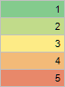
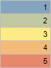
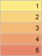
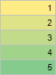
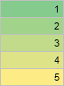
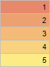
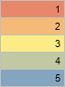
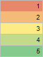

# TabConditionPredefinedGradientStyle

TabConditionPredefinedGradientStyle
-

# TabConditionPredefinedGradientStyle

## Описание

Перечисление TabConditionPredefinedGradientStyle
 содержит стандартные стили градиентных заливок, используемые при условном
 форматировании ячеек.

Используется следующим методом:

	- [ITabFormatCondition.AssignPredefinedGradient](../Interface/ITabFormatCondition/ITabFormatCondition.AssignPredefinedGradient.htm).

## Допустимые значения

		 Значение
		 Краткое описание

		 0
		 GreenYellowRed

		 1
		 BlueYellowRed

		 2
		 YellowRed

		 3
		 YellowGreen

		 4
		 GreenYellow

		 5
		 RedYellow

		 6
		 RedYellowBlue

		 7
		 RedYellowGreen

См. также:

[Перечисления
 сборки Tab](TabSheet_Enums.htm)

		Справочная
		 система на версию 10.9
		 от 18/08/2025,
		 © ООО «ФОРСАЙТ»,
