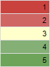
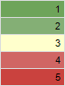
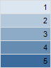
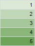
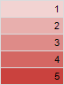
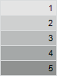

# TabConditionPredefinedScaleStyle

TabConditionPredefinedScaleStyle
-

# TabConditionPredefinedScaleStyle

## Описание

Перечисление TabConditionPredefinedScaleStyle
 содержит стандартные стили цветовой шкалы, используемые при условном форматировании
 ячеек.

Используется следующим методом:

	- [ITabFormatCondition.AssignPredefinedScale](../Interface/ITabFormatCondition/ITabFormatCondition.AssignPredefinedScale.htm).

## Допустимые значения

		 Значение
		 Краткое описание

		 0
		 RedGreen

		 1
		 GreenRed

		 2
		 BlueGradient

		 3
		 GreenGradient

		 4
		 RedGradient

		 5
		 GreyGradient

См. также:

[Перечисления
 сборки Tab](TabSheet_Enums.htm)

		Справочная
		 система на версию 10.9
		 от 18/08/2025,
		 © ООО «ФОРСАЙТ»,
