# TabCursor

TabCursor
-

# TabCursor

## Описание

Перечисление TabCursor содержит
 типы курсора, которые могут отображаться при наведении мыши.

Используется следующими свойствами и методами:

	- [ITabCellStyle.Cursor](../Interface/ITabCellStyle/ITabCellStyle.Cursor.htm);

	- [ITabCellStyle.PictureCursor](../Interface/ITabCellStyle/ITabCellStyle.PictureCursor.htm).

## Допустимые значения

		 Значение
		 Краткое описание

		 -1
		 Undefined. Курсор
		 не определен.

		 0
		 StdAppStarting.
		 Фоновый режим.

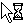

		 1
		 StdArrow. Основной
		 режим.

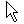

		 2
		 StdCross. Графическое
		 выделение.

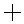

		 3
		 Hand. Выбор ссылки.

		 4
		 StdHelp. Выбор
		 справки.

		 5
		 StdNo. Операция
		 невозможна.

		 6
		 StdSizeAll. Перемещение.

		 7
		 StdSizeNESW.
		 Изменение размеров по диагонали 2.

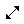

		 8
		 StdSizeNS. Изменение
		 вертикальных размеров.

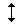

		 9
		 StdSizeNWSE.
		 Изменение размеров по диагонали 1.

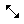

		 10
		 StdSizeWE. Изменение
		 горизонтальных размеров.

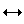

		 11
		 StdUpArrow. Специальное
		 выделение.

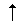

		 12
		 StdWait. Система
		 недоступна.

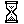

		 13
		 SelectRow. Выделение
		 строки.

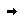

		 14
		 DragCopy. Копирование
		 данных с помощью мыши.

		 15
		 DragMove. Перемещение
		 данных с помощью мыши.

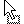

		 16
		 HandMove. Перемещение
		 видимой области документа

		 17
		 HandMovig. Перемещение
		 над документом.

		 18
		 ResizeColumn.
		 Изменение размера столбца.

		 19
		 ResizeRow. Изменение
		 размера строки.

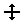

		 20
		 ResizeScroll.
		 Прокрутка документа.

		 21
		 ScrollDown. Прокрутка
		 документа вниз.

		 22
		 ScrollDownLeft.
		 Прокрутка документа в левый нижний угол.

		 23
		 ScrollDownRight.
		 Прокрутка документа в правый нижний угол.

		 24
		 ScrollLeft. Прокрутка
		 документа влево.

		 25
		 ScrollRight. Прокрутка
		 документа вправо.

		 26
		 ScrollUp. Прокрутка
		 документа вверх.

		 27
		 ScrollUpLeft. Прокрутка
		 документа в левый верхний угол.

		 28
		 ScrollUpRight. Прокрутка
		 документа в правый верхний угол.

		 29
		 SelectCell. Выделение
		 ячейки.

		 30
		 SelectColumn. Выделение
		 столбца.

		 31
		 ShowColumn. Отобразить
		 скрытый столбец.

		 32
		 ShowRow. Отобразить
		 скрытую строку.

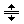

		 38
		 StdIbeam. Текстовое
		 выделение.

		 39
		 StdHand. Выбор
		 ссылки.

См. также:

[Перечисления сборки Tab](TabSheet_Enums.htm)

		Справочная
		 система на версию 10.9
		 от 18/08/2025,
		 © ООО «ФОРСАЙТ»,
