# TabTablePredefinedStyle

TabTablePredefinedStyle
-

# TabTablePredefinedStyle

## Описание

Перечисление TabTablePredefinedStyle
 содержит стили оформления таблицы.

Используется следующими методами и свойствами:

	- [ITabTableStyle.AssignPredefined](../Interface/ITabTableStyle/ITabTableStyle.AssignPredefined.htm);

	- [ITabTableStyle.PredefinedStyle](../Interface/ITabTableStyle/ITabTableStyle.PredefinedStyle.htm).

## Допустимые значения

		 Значение
		 Краткое описание

		 -1
		 Undefined. Чередующийся
		 стиль создан пользователем.

		 0
		 Blue.
		 Синий:

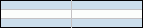

		 1
		 DarkBlue.
		 Темно-синий:

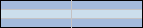

		 2
		 Red. Красный:

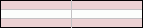

		 3
		 DarkRed.
		 Темно-красный:

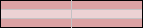

		 4
		 Green.
		 Зеленый:

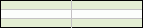

		 5
		 DarkGreen.
		 Темно-зеленый:

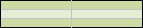

		 6
		 Purple.
		 Фиолетовый:

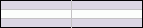

		 7
		 DarkPurple.
		 Темно-фиолетовый:

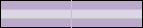

		 8
		 Orange.
		 Оранжевый:

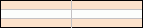

		 9
		 DarkOrange.
		 Темно-оранжевый:

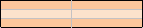

		 10
		 ExtBlueStriped. Синий
		 (без границ):

		 11
		 ExtBlue. Синий (с границами):

		 12
		 ExtGreyStriped. Серый
		 (без границ):

		 13
		 ExtGrey. Серый (с границами):

		 14
		 ExtDarkBlueStriped.
		 Темно-синий (без границ):

		 15
		 ExtDarkBlue. Темно-синий
		 (с границами):

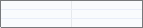

		 16
		 ExtGreenStriped. Зеленый
		 (без границ):

		 17
		 ExtGreen. Зеленый (с
		 границами):

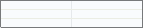

		 18
		 ExtBrownStriped. Коричневый
		 (без границ):

		 19
		 ExtBrown. Коричневый
		 (с границами):

		 20
		 ExtRedStriped. Красный
		 (без границ):

		 21
		 ExtRed. Красный (с
		 границами):

См. также:

[Перечисления сборки Tab](TabSheet_Enums.htm)

		Справочная
		 система на версию 10.9
		 от 18/08/2025,
		 © ООО «ФОРСАЙТ»,
