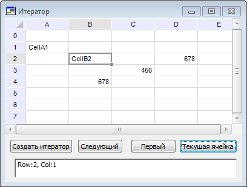

# ITabCellIterator.CurrentCell

ITabCellIterator.CurrentCell
-

# ITabCellIterator.CurrentCell

## Синтаксис

CurrentCell: [ITabRange](../ITabRange/ITabRange.htm);

## Описание

Свойство CurrentCell возвращает
 ячейку, в которой в данный момент находится итератор.

## Пример

Для выполнения примера создайте форму, приведенную в примере для метода
 [ITabCellIterator.Next](ITabCellIterator.Next.htm). Добавьте
 на форму кнопки «Button3» и «Button4» и компонент EditBox с наименованием
 «EditBox1».

Добавим обработчики событий нажатия на кнопки «Button3» и «Button4»:

	Sub Button1OnClick(Sender: Object; Args: IMouseEventArgs);

	Begin

	    iter.First;

	    End Sub Button1OnClick;

	Sub Button2OnClick(Sender: Object; Args: IMouseEventArgs);

	Begin

	    EditBox1.Text:= "Row:" + iter.CurrentRow.ToString + ", Col:" + iter.CurrentColumn.ToString;

	    iter.CurrentCell.Value:= "Cell"+ iter.CurrentCell.Address;

	End Sub Button2OnClick;

Выполните пример. В таблице введите значения в произвольные ячейки.
 Создайте итератор, выбрав диапазон таблицы и нажав на кнопку «Button1»,
 которая была создана в примере для [ITabCellIterator.Next](ITabCellIterator.Next.htm).
 Нажмите кнопку «Button3» (в нашем примере - кнопка с текстом «Первый»):
 будет осуществлен переход к первому элементу. Нажмите кнопку «Button4»
 (в нашем примере - кнопка с текстом «Текущая ячейка»): в компоненте EditBox
 будет выведен текст «Row:-1, Col:-1» - индексы строки и столбца первой
 ячейки итератора.

Перейдите на следующий элемент итератора при помощи кнопки «Button2», которая
 была создана в примере для [ITabCellIterator.Next](ITabCellIterator.Next.htm).
 Нажмите кнопку «Button4»: значение ячейки изменится на «Cell <адрес ячейки>», в компоненте
 EditBox будет выведен текст «Row:-<индекс
 строки>, Col: <индекс столбца>»:

См. также:

[ITabCellIterator](ITabCellIterator.htm)

		Справочная
		 система на версию 10.9
		 от 18/08/2025,
		 © ООО «ФОРСАЙТ»,
