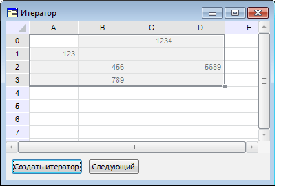

# ITabCellIterator.Next

ITabCellIterator.Next
-

# ITabCellIterator.Next

## Синтаксис

Next: Boolean;

## Описание

Метод Next осуществляет переход
 на следующий элемент итератора.

## Комментарии

При первом вызове метода осуществляется переход на первый элемент итератора.

## Пример

Для выполнения примера создайте форму и разместите на ней следующие
 компоненты:

	- TabSheetBox с наименованием «TabSheetBox1»;

	- UiTabSheet c наименованием «UiTabSheet1». Компонент UiTabSheet
	 является источником данных для компонента TabSheetBox;

	- компоненты Button с наименованиями «Button1» и «Button2».

Подключите ссылку на системную сборку Tab.

Добавим обработчики событий нажатия на кнопки «Button1» и «Button2».

	Class ITERATORForm: Form

	    TabSheetBox1: TabSheetBox;

	    UiTabSheet1: UiTabSheet;

	    Button1: Button;

	    Button2: Button;

	    iter : ITabCellIterator;

	    tab : ITabSheet;

	    Sub Button1OnClick(Sender: Object; Args: IMouseEventArgs);

	    Begin

	        tab:= UiTabSheet1.TabSheet;

	        //cоздаем итератор для выделенного диапазона ячеек

	        iter := tab.View.Selection.Range.CreateIterator;

	        //определяем порядок «по столбцам»

	        iter.Order := TabCellIteratorOrder.Columns;

	    End Sub Button1OnClick;

	    Sub Button2OnClick(Sender: Object; Args: IMouseEventArgs);

	    Begin

	        //выделяем в таблице ячейки, на которые переходит итератор

	        If iter.Next Then

	            tab.View.Selection.Range := tab.Cell(iter.CurrentRow,iter.CurrentColumn);

	        End If;

	    End Sub Button2OnClick;

	End Class ITERATORForm;

После выполнения примера будет создана форма. Введите значения в некоторые
 ячейки и выделите диапазон, включающий в себя эти ячейки:

При нажатии на кнопку «Button1» (в нашем примере это кнопка с текстом
 «Создать итератор») для выделенного диапазона таблицы будет создан итератор
 и определен порядок перехода по ячейкам таблицы - «По столбцам».

Нажмите на кнопку «Button2» (в нашем примере это кнопка с текстом «Следующий»).
 Будет выделена первая ячейка, содержащая значение (в нашем примере это
 ячейка A1). При дальнейшем нажатии на кнопку «Button2» будут выделяться
 ячейки, по которым переходит итератор. Установлен [порядок
 перехода](ITabCellIterator.Order.htm) «По столбцам», поэтому ячейки будут выделяться в следующей
 последовательности: A1-B2-B3-C0-D2. При [выборе
 порядка перехода](ITabCellIterator.Order.htm) «По строкам» ячейки будут выделяться в следующей
 последовательности: C0-A1-B2-D2-B3.

См. также:

[ITabCellIterator](ITabCellIterator.htm)

		Справочная
		 система на версию 10.9
		 от 18/08/2025,
		 © ООО «ФОРСАЙТ»,
