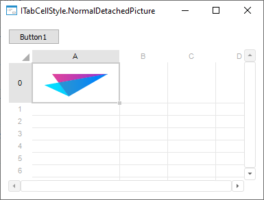

# ITabCellStyle.NormalDetachedPicture

ITabCellStyle.NormalDetachedPicture
-

# ITabCellStyle.NormalDetachedPicture

## Синтаксис

NormalDetachedPicture: [IGxImage](ModDrawing.chm::/Interface/IGxImage/IGxImage.htm);

## Описание

Свойство NormalDetachedPicture
 загружает выбранное изображение в ячейку таблицы.

## Комментарии

Для использования изображений в ячейке для свойства [ITabCellStyle.EnablePictures](ITabCellStyle.EnablePictures.htm)
 задайте значение [TriState.OnOption](ForeSys.chm::/Enums/TriState.htm).

Изображения можно добавлять из директории или с помощью компонентов
 [ImageBox](UiDevEnv.chm::/02_Components_constructor_forms/02_Additional_components/ImageBox.htm) и [ImageList](UiDevEnv.chm::/02_Components_constructor_forms/02_Additional_components/ImageList.htm).

Для добавления изображения из коллекции используйте свойство [ITabCellStyle.NormalPicture](ITabCellStyle.NormalPicture.htm).

## Пример

Для выполнения примера разместите на форме компонент Button, TabSheetBox
 и UiTabSheet с наименованиями BUTTON1,
 TABSHEETBOX1 И UITABSHEET1
 соответственно. Для компонента TabSheetBox установите свойству
 Source значение UiTabSheet1. Убедитесь, что в корневом каталоге диска
 С имеется изображение Image.png.

Добавьте ссылки на системные сборки: Drawing, Forms, Tab.

	Sub Button1OnClick(Sender: Object; Args: IMouseEventArgs);

	Var

	    Sheet: ITabSheet;

	    Range: ITabRange;

	    Style: ITabCellStyle;

	    Image: IGxImage;

	Begin

	    Sheet := UiTabSheet1.TabSheet;

	    Range := Sheet.View.Selection.Range;

	    Image := GxImage.FromFile("C:\Image.png");

	    Style := Range.Style;

	    Style.EnablePictures := TriState.OnOption;

	    Style.NormalDetachedPicture := Image;

	End Sub Button1OnClick;

В результате при нажатии на кнопку в выделенную ячейку таблицы будет
 добавлено заданное изображение, например:

См. также:

[ITabCellStyle](ITabCellStyle.htm)

		Справочная
		 система на версию 10.9
		 от 18/08/2025,
		 © ООО «ФОРСАЙТ»,
