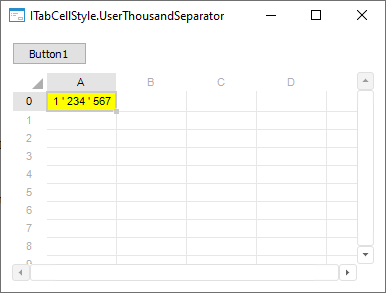

# ITabCellStyle.UserThousandSeparator

ITabCellStyle.UserThousandSeparator
-

# ITabCellStyle.UserThousandSeparator

## Синтаксис

UserThousandSeparator: String;

## Описание

Свойство UserThousandSeparator
 устанавливает пользовательский разделитель разрядов.

## Комментарии

Для установки пользовательского разделителя разрядов определите формат
 отображения данных в ячейке таблицы с помощью свойства [ITabCellStyle.CustomFormat](ITabCellStyle.CustomFormat.htm).

## Пример

Для выполнения примера разместите на форме компонент Button, TabSheetBox
 и UiTabSheet с наименованиями BUTTON1,
 TABSHEETBOX1 И UITABSHEET1
 соответственно. Для компонента TabSheetBox1 установите свойству Source
 значение UiTabSheet1.

Добавьте ссылки на системные сборки: Drawing, Tab, Forms.

	Sub Button1OnClick(Sender: Object; Args: IMouseEventArgs);

	Var

	    Style: ITabCellStyle;

	    Sheet: ITabSheet;

	    Range: ITabRange;

	    Color: IGxColor;

	    SolidBrush: IGxBrush;

	Begin

	    Sheet := UiTabSheet1.TabSheet;

	    Range := Sheet.View.Selection.Range;

	    Style := Range.Style;

	    Style.CustomFormat:= "# ##0";

	    Style.UserThousandSeparator:= " ' ";

	    Color := GxColor.FromName("Yellow");

	    SolidBrush := New GxSolidBrush.Create(Color);

	    Style.BackgroundBrush := SolidBrush;

	End Sub Button1OnClick;

В результате при нажатии на кнопку в ячейке будет изменен пользовательский
 разделитель разрядов, например:

См. также:

[ITabCellStyle](ITabCellStyle.htm)

		Справочная
		 система на версию 10.9
		 от 18/08/2025,
		 © ООО «ФОРСАЙТ»,
