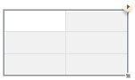
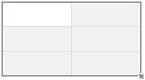

# ITabContextButton.Visible

ITabContextButton.Visible
-

# ITabContextButton.Visible

## Синтаксис

Visible: Boolean;

## Описание

Свойство Visible определяет,
 будет ли отображаться контекстная кнопка выделенной области.

## Комментарии

Допустимые значения:

	- True. Контекстная кнопка
	 будет отображаться;

	- False. По умолчанию.
	 Контекстная кнопка отображаться не будет.

Например:

		 True

		 False

		 
		 

Контекстная кнопка содержит пункты, описанные на странице «[Выделение элементов
 таблицы](uianalyticalarea.chm::/Select_areas.htm)».

## Пример

Для выполнения примера в репозитории необходимо наличие:

	- формы, содержащей компоненты:

		- TabSheetBox
		 с идентификатором «TabSheetBox1»;

		- UiReport
		 с идентификатором «UiReport1», который является источником данных
		 для «TabSheetBox1»;

	- регламентного отчета, являющегося источником данных для «UiReport1».
	 Отчет содержит [обычную
	 область данных](UiReport.chm::/desktop/AreaData/UiReport_AreaData.htm#areadata_create).

			Sub UserProc;

Var

    Rep: IPrxReport;

    Sheet: IPrxTable;

    Tab: ITabSheet;

    View: ITabView;

    ConButton: ITabContextButton;

Begin

    // Получим регламентный отчет

    Rep := UiReport1.Report;

    // Получим активный лист отчета

    Sheet := Rep.ActiveSheet As IPrxTable;

    // Получим таблицу листа

    Tab := Sheet.TabSheet;

    // Получим представление электронной таблицы

    View := Tab.View;

    // Получим контекстную кнопку и включим ее видимость

    ConButton := View.ContextButton;

    ConButton.Visible := True;

    // Обновим отчет

    Rep.Recalc;

End Sub UserProc;

После выполнения примера в правом верхнем углу у выделенной области
 будет появляться контекстная кнопка.

См. также:

[ITabContextButton](ITabContextButton.htm)

		Справочная
		 система на версию 10.9
		 от 18/08/2025,
		 © ООО «ФОРСАЙТ»,
