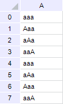
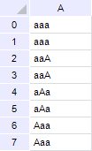

# ITabCustomSort.CaseSensitive

ITabCustomSort.CaseSensitive
-

# ITabCustomSort.CaseSensitive

## Синтаксис

CaseSensitive: Boolean;

## Описание

Свойство CaseSensitive определяет,
 будет ли учитываться регистр символов при сортировке.

## Пример

Для выполнения примера предполагается наличие формы, расположенной на
 ней кнопки с наименованием «Button1»,
 компонента TabSheetBox с наименованием «TabSheetBox1»
 и компонента UiReport, настроенного на отчет и являющийся источником данных
 для компонента TabSheetBox.

Необходимо подключить системные сборки: Report, Tab.

	Sub Button1OnClick(Sender: Object; Args: IMouseEventArgs);

	Var

	    Tab: ITabSheet;

	    Report: IPrxReport;

	    Sheet: IPrxSheet;

	    CustomSort: ITabCustomSort;

	    SortItem: ITabCustomSortItem;

	Begin

	    // Получим экземпляр таблицы

	    Report := UiReport1.Report;

	    Sheet := Report.ActiveSheet;

	    Tab := (Sheet As IPrxTable).TabSheet;

	    // Зададим настройки сортировки таблицы

	    CustomSort := Tab.CustomSort;

	    CustomSort.Clear;

	    CustomSort.Range := Tab.Table;

	    CustomSort.Add(Tab.ColumnIndex("A"));

	    CustomSort.CaseSensitive := True;

	    SortItem := CustomSort.Item(0);

	    SortItem.Direction := TabCustomSortDirection.Ascending;

	    SortItem.Type := TabCustomSortType.Text;

	    // Применим сортировку

	    CustomSort.Sort;

	    // Определим была
	 ли использована сортировка по столбцам

	    debug.Write(CustomSort.IsColumnSort.ToString);

	End Sub Button1OnClick;

При нажатии кнопки будет настроена сортировка по возрастанию в столбце
 «A». При этом будет учитываться регистр символов.

Сортировка без учета регистра:

Сортировка с учетом регистра:

См. также:

[ITabCustomSort](ITabCustomSort.htm)

		Справочная
		 система на версию 10.9
		 от 18/08/2025,
		 © ООО «ФОРСАЙТ»,
