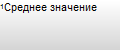

# ITabFootnotes.BackgroundBrush

ITabFootnotes.BackgroundBrush
-

# ITabFootnotes.BackgroundBrush

## Синтаксис

BackgroundBrush: [IGxBrush](ModDrawing.chm::/Interface/IGxBrush/IGxBrush.htm);

## Описание

Свойство BackgroundBrush определяет
 кисть, которая будет использоваться для заполнения фона панели сносок.

## Комментарии

В качестве значения свойства указывается экземпляр одного из следующих
 классов:

	- [GxHatchBrush](ModDrawing.chm::/Class/GxHatchBrush/GxHatchBrush.htm).
	 Штриховая кисть с заданным узором;

	- [GxLinearGradientBrush](ModDrawing.chm::/Class/GxLinearGradientBrush/GxLinearGradientBrush.htm).
	 Линейно-градиентная кисть;

	- [GxSolidBrush](ModDrawing.chm::/Class/GxSolidBrush/GxSolidBrush.htm).
	 Кисть, осуществляющая заливку сплошным цветом;

	- [GxTextureBrush](ModDrawing.chm::/Class/GxTextureBrush/GxTextureBrush.htm).
	 Текстурная кисть, использующая в качестве фона какое-либо изображение.

Панель сносок используется в различных инструментах продукта «Форсайт. Аналитическая платформа»,
 доступ к параметрам для её настройки предоставляют следующие свойства:

	- [IEaxGrid.FootnotePanelOptions](KeExpress.chm::/Interface/IEaxGrid/IEaxGrid.FootnotePanelOptions.htm).
	 Панель сносок в экспресс-отчете;

	- [IPrxReportOptions.FootnotePanelOptions](KeReport.chm::/Interface/IPrxReportOptions/IPrxReportOptions.FootnotePanelOptions.htm).
	 Панель сносок в регламентном отчете.

Также панель сносок реализует компонент среды разработки TabFootnotesBox.

## Пример

Для выполнения примера предполагается наличие формы, расположенной на
 ней кнопки с наименованием «Button1», компонента UiTabSheet
 с наименованием «UiTabSheet1» и компонента TabFootnotesBox,
 для которого «UiTabSheet1» установлен в качестве источника данных. Добавьте
 ссылку на системную сборку Drawing.

			Sub Button1OnClick(Sender: Object; Args: IMouseEventArgs);

Var

    TabSheet: ITabSheet;

    Footnotes: ITabFootnotes;

    Footnote: ITabFootnote;

Begin

    TabSheet := UiTabSheet1.TabSheet;

    Footnotes := TabSheet.Footnotes;

    //Градиент от белого до лазурного по вертикали компонента

    Footnotes.BackgroundBrush := New GxLinearGradientBrush.Create(

        GxColor.FromKnownColor(GxKnownColor.White),

        GxColor.FromKnownColor(GxKnownColor.DarkGray),

        90);

    //Новая сноска

    Footnote := Footnotes.Add(0, 0);

    Footnote.Text := "Среднее значение";

End Sub Button1OnClick;

При нажатии на кнопку в коллекцию сносок таблицы будет добавлена одна
 сноска, а для панели сносок будет задан градиентный фон. Компонент TabFootnotesBox
 при этом примет примерно следующий вид:

См. также:

[ITabFootnotes](ITabFootnotes.htm)

		Справочная
		 система на версию 10.9
		 от 18/08/2025,
		 © ООО «ФОРСАЙТ»,
