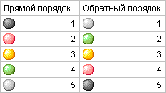

# ITabFormatValues.ReverseIcons

ITabFormatValues.ReverseIcons
-

# ITabFormatValues.ReverseIcons

## Синтаксис

ReverseIcons: Boolean;

## Описание

Свойство ReverseIcons определяет,
 будет ли использоваться при форматировании обратный порядок пиктограмм.

## Комментарии

По умолчанию свойству установлено значение False,
 при этом используется прямой порядок. Актуально, если свойству [Style](ITabFormatValues.Style.htm)
 установлено значение IconSets.

## Пример

См. также:

[ITabFormatValues](ITabFormatValues.htm)

		Справочная
		 система на версию 10.9
		 от 18/08/2025,
		 © ООО «ФОРСАЙТ»,
