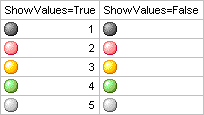

# ITabFormatValues.ShowValues

ITabFormatValues.ShowValues
-

# ITabFormatValues.ShowValues

## Синтаксис

ShowValues: Boolean;

## Описание

Свойство ShowValues определяет,
 будут ли отображаться значения в ячейках при использовании условного формата.

## Комментарии

По умолчанию свойству установлено значение True,
 при этом значения отображаются. Актуально, если свойству [Style](ITabFormatValues.Style.htm)
 установлено значение IconSets.

## Пример

См. также:

[ITabFormatValues](ITabFormatValues.htm)

		Справочная
		 система на версию 10.9
		 от 18/08/2025,
		 © ООО «ФОРСАЙТ»,
