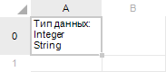

# ITabRange.AdjustHeight

ITabRange.AdjustHeight
-

# ITabRange.AdjustHeight

## Синтаксис

AdjustHeight([MaxHeight: Double = -1;][MinHeight:
 Double = -1]);

## Параметры

MaxHeight. Максимальная высота
 строки, которая может быть установлена при автоматической подгонке. По
 умолчанию установлено значение «-1», при этом максимальная высота ограничивается
 максимальной высотой содержимого ячеек диапазона. Значение параметра указывается
 в миллиметрах.

MinHeight. Минимальная
 высота строки, которая может быть установлена при автоматической подгонке.
 По умолчанию установлено значение «-1», при этом минимальная высота ограничивается
 минимальной высотой содержимого ячеек диапазона. Значение параметра указывается
 в миллиметрах.

## Описание

Метод AdjustHeight выполняет
 автоматическую подгонку высоты строк диапазона в соответствии с содержимым
 ячеек.

## Комментарии

Автоматическая подгонка производится таким образом, чтобы содержимое
 всех ячеек диапазона было видно полностью и при этом в ячейках не оставалось
 лишнего свободного места. При подгонке учитываются форматы шрифта, выравнивание
 и отступы ячеек. Также учитываются значения параметров MaxHeight
 и MinHeight, которые могут быть
 указаны для данного метода.

Примечание.
 Если для ячейки диапазона установлен перенос текста по словам (слов по
 слогам), то при автоматической подгонке будет учитываться высота всех
 строк, содержащихся в ячейке. Расстановка переносов при этом сохраняется.
 Применяется как для одиночных, так и для объединенных ячеек с установленным
 переносом текста.

## Пример

Для выполнения примера предполагается наличие формы, расположенной на
 ней кнопки, компонента TabSheetBox с наименованием TabSheetBox1 и какого-либо
 источника данных для этого компонента. В ячейке A0 таблицы имеются данные.

			Sub Button1OnClick(Sender: Object; Args: IMouseEventArgs);

Var

    Tab: ITabSheet;

    Range: ITabRange;

Begin

    Tab := TabSheetBox1.Source.GetTabSheet;

    Range := Tab.ParseCell("A0");

    Range.AdjustHeight;

    Range.AdjustWidth;

End Sub Button1OnClick;

При нажатии на кнопку будет осуществлена автоматическая подгонка высоты
 и ширины строк/столбцов в соответствии с содержимым ячейки А0.

Исходная ячейка с данными:

Результат выполнения примера:

См. также:

[ITabRange](ITabRange.htm)

		Справочная
		 система на версию 10.9
		 от 18/08/2025,
		 © ООО «ФОРСАЙТ»,
