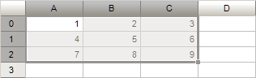

# ITabRange.ExtendToAdjacentCells

ITabRange.ExtendToAdjacentCells
-

# ITabRange.ExtendToAdjacentCells

## Синтаксис

		ExtendToAdjacentCells: [ITabRange](ITabRange.htm);

## Описание

Метод ExtendToAdjacentCells возвращает диапазон ячеек, полученный путём расширения текущего на соседние непустые ячейки.

## Пример

			Var

    TSheet: ITabSheet;

    TSel: ITabSelection;

    TRange1, TRange2: ITabRange;

Begin

    TSheet := //Получение параметров таблицы

    TSel := TSheet.View.Selection;

    //Получение выделенного диапазона
    TRange1 := TSel.Range;

    //Расширение диапазона
    TRange2 := TRange1.ExtendToAdjacentCells;

    //Выделение полученного диапазона в таблице
    TSel.Range := TRange2;

При нажатии на кнопку будет получен диапазон, выделенный в текущий момент в таблице. Данный диапазон будет расширен до диапазона, включающего все соседние непустые ячейки. Полученный диапазон будет выделен в таблице.

Исходная таблица с выделенной ячейкой A0:

Выделенный диапазон, полученный при работе метода ExtendToAdjacentCells:

См. также:

[ITabRange](ITabRange.htm)

		Справочная
		 система на версию 10.9
		 от 18/08/2025,
		 © ООО «ФОРСАЙТ»,
