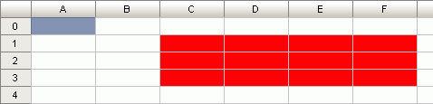

# ITabRange.Offset

ITabRange.Offset
-

# ITabRange.Offset

## Синтаксис

Offset(

RowCount: Integer;

ColumnCount: Integer;

[Height: Integer = 0;]

[Width: Integer = 0]):
 [ITabRange](ITabRange.htm);

## Параметры

RowCount. Количество строк,
 на которые необходимо сместить диапазон.

ColumnCount. Количество столбцов,
 на которые необходимо сместить диапазон.

Height. Высота возвращаемого
 диапазона в ячейках.

Width. Ширина возвращаемого
 диапазона в ячейках.

## Описание

Метод Offset возвращает диапазон
 ячеек, смещенный в соответствии с заданными параметрами.

## Комментарии

Смещение производится на RowCount
 строк, ColumnCount столбцов и
 рассчитывается от текущего диапазона. По умолчанию, высота и ширина возвращаемого
 диапазона совпадает с шириной и высотой исходного диапазона. Используя
 параметры Height и Width,
 можно задать высоту и ширину возвращаемого диапазона.

## Пример

Для выполнения примера предполагается наличие формы, расположенной на
 ней кнопки с наименованием «Button1», компонента UiTabSheet с наименованием
 «UiTabSheet1» и компонента TabSheetBox. Текущий диапазон ячеек A0.

	Sub Button1OnClick(Sender: Object; Args: IMouseEventArgs);

	Var

	    Range: ITabRange;

	    OffRange: ITabRange;

	Begin

	    Range := UiTabSheet1.TabSheet.View.Selection.Range;

	    OffRange := Range.Offset(1, 2, 3, 4);

	    OffRange.Style.BackgroundColor := GxColor.FromName("Red");

	End Sub Button1OnClick;

После выполнения примера фон диапазона, смещенного от текущего в соответствии
 с заданными параметрами, будет красным:

См. также:

[ITabRange](ITabRange.htm)

		Справочная
		 система на версию 10.9
		 от 18/08/2025,
		 © ООО «ФОРСАЙТ»,
