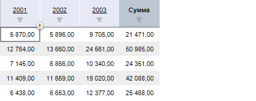
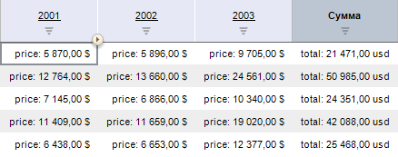

# ITabRange.Prefix

ITabRange.Prefix
-

# ITabRange.Prefix

## Синтаксис

Prefix: Variant;

## Описание

Свойство Prefix определяет префикс
 ячейки таблицы.

## Комментарии

Префикс отображается перед значением ячейки таблицы. Не участвует в
 расчете условного форматирования или вычисляемых формулах.

## Пример

Для выполнения примера предполагается наличие формы, содержащей компонент
 Button с идентификатором «Button1», компонент TabSheetBox с идентификатором
 «TabSheetBox1», и свойством «Source» настроенным на компонент UiErAnalyzer
 с идентификатором «UiErAnalyzer1». Компоненту «UiErAnalyzer1» свойству
 «Active» установлено значение true, а свойство «Object» настроено на готовый
 экспресс отчет. Пример является обработчиком события OnClick для компонента
 «Button1»:

	Sub Button1OnClick(Sender: Object; Args: IMouseEventArgs);

	Var

	    Tsheet: ITabSheet;

	    Range: ITabRange;

	    i, r, c: integer;

	Begin

	    TSheet := TabSheetBox1.Source.GetTabSheet;

	    r := TSheet.MaxUsedRow;

	    c := TSheet.MaxUsedColumn;

	    // Выделим в диапазон все ячейки таблиц кроме шапки

	    Range := Tsheet.Cells(1, 0, r, c);

	    // Зададим всему диапазону суффикс и префикс

	    Range.Prefix := "price: ";

	    Range.Suffix := " $";

	    // В последний столбец пропишем отдельные суффиксы и префиксы

	    i := 1;

	    While (i <= r) Do

	        TSheet.CellPrefix(i, c) := "total: ";

	        TSheet.CellSuffix(i, c) := " usd";

	        i := i + 1;

	    End While;

	    // Подгоним ширину столбцов под новое содержание

	    Range.AdjustWidth;

	End Sub Button1OnClick;

В результате выполнения примера после нажатия кнопки ячейкам таблицы
 были добавлены префиксы и суффиксы.

До выполнения примера:

После выполнения примера:

См. также:

[ITabRange](ITabRange.htm)

		Справочная
		 система на версию 10.9
		 от 18/08/2025,
		 © ООО «ФОРСАЙТ»,
