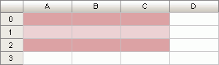

# ITabTableStyle.AssignPredefined

ITabTableStyle.AssignPredefined
-

# ITabTableStyle.AssignPredefined

## Синтаксис

AssignPredefined(Style: [TabTablePredefinedStyle](../../Enums/TabTablePredefinedStyle.htm));

## Параметры

Style - стиль, параметры которого
 необходимо установить для текущего стиля оформления таблицы.

## Описание

Метод AssignPredefined осуществляет
 установку параметров стиля оформления таблицы в соответствии с параметрами
 стиля оформления, передаваемого посредством параметра Style.

## Пример

Для выполнения примера предполагается наличие формы, расположенной на
 ней кнопки с наименованием «Button1», компонента UiTabSheet
 с наименованием «UiTabSheet1» и компонента TabSheetBox.

	Sub Button1OnClick(Sender: Object; Args: IMouseEventArgs);

	Var

	    Range: ITabRange;

	    TSheet: ITabSheet;

	    TTStyles: ITabTableStyles;

	    TStyle: ITabTableStyle;

	Begin

	    TSheet := UiTabSheet1.TabSheet;

	    Range := TSheet.View.Selection.Range;

	    TTStyles := Range.TableStyles;

	    TStyle := TTStyles.Add;

	    TStyle.AssignPredefined(TabTablePredefinedStyle.DarkRed);

	End Sub Button1OnClick;

После выполнения примера для выделенной области ячеек таблицы (A0:C2)
 будет создан стиль оформления. Параметры созданного стиля будут установлены
 в соответствии с параметрами базового темно-красного стиля оформления:

См. также:

[ITabTableStyle](ITabTableStyle.htm)

		Справочная
		 система на версию 10.9
		 от 18/08/2025,
		 © ООО «ФОРСАЙТ»,
