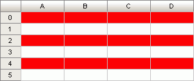

# ITabTableStyle.RowFirstStripe

ITabTableStyle.RowFirstStripe
-

# ITabTableStyle.RowFirstStripe

## Синтаксис

RowFirstStripe: [ITabTableStripe](../ITabTableStripe/ITabTableStripe.htm);

## Описание

Свойство RowFirstStripe возвращает
 параметры стиля оформления первой полосы строк в таблице.

## Пример

Для выполнения примера предполагается наличие формы, расположенной на
 ней кнопки с наименованием «Button1», компонента UiTabSheet
 с наименованием «UiTabSheet1» и компонента TabSheetBox.

	Sub Button1OnClick(Sender: Object; Args: IMouseEventArgs);

	Var

	    Range: ITabRange;

	    TSheet: ITabSheet;

	    TTStyles: ITabTableStyles;

	    TStyle: ITabTableStyle;

	    s1: ITabCellStyle;

	Begin

	    s1 := New TabCellStyle.Create;

	    s1.BackgroundColor := GxColor.FromName("Red");

	    TSheet := UiTabSheet1.TabSheet;

	    Range := TSheet.View.Selection.Range;

	    TTStyles := Range.TableStyles;

	    TStyle := TTStyles.Add;

	    TStyle.RowFirstStripe.Style := s1;

	End Sub Button1OnClick;

После выполнения примера для выделенной области ячеек(A0:D4) цвет фона
 первой полосы строк будет изменен на красный:

См. также:

[ITabTableStyle](ITabTableStyle.htm) | [Элементы стиля оформления
 таблицы](ITabTableStyle.Style_Order_rule.htm)

		Справочная
		 система на версию 10.9
		 от 18/08/2025,
		 © ООО «ФОРСАЙТ»,
