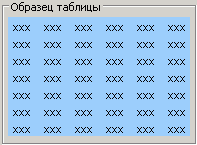
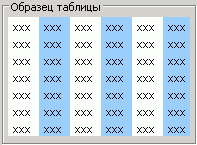
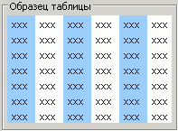
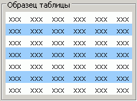
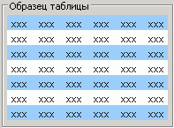
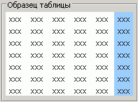
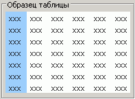
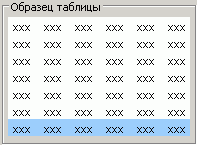
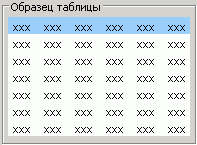
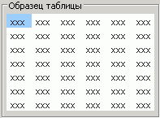

# Элементы стиля оформления таблицы

Элементы стиля оформления таблицы
-

# Элементы стиля оформления таблицы

В стиле оформления таблицы выделяют различные элементы. При работе со
 стилем таблицы данные элементы имеют следующий приоритет (от меньшему
 к большему, голубым цветом выделены элементы стиля):

	- вся таблица:

	- вторая полоса столбцов:

	- первая полоса столбцов:

	- вторая полоса строк:

	- первая полоса строк:

	- последняя полоса столбцов:

	- заголовки строк:

	- последняя полоса строк:

	- заголовки столбцов:

	- угол таблицы:

См. также:

[ITabTableStyle](ITabTableStyle.htm)

		Справочная
		 система на версию 10.9
		 от 18/08/2025,
		 © ООО «ФОРСАЙТ»,
