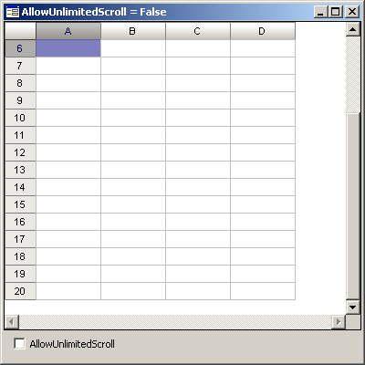

# ITabView.AllowUnlimitedScroll

ITabView.AllowUnlimitedScroll
-

# ITabView.AllowUnlimitedScroll

## Синтаксис

AllowUnlimitedScroll: Boolean;

## Описание

Свойство AllowUnlimitedScroll
 определяет режим прокрутки строк в таблице.

## Комментарии

По умолчанию свойству установлено значение True,
 при этом прокрутка с помощью мыши осуществляется до тех пор, пока в видимой
 зоне компонента не останется последняя строка таблицы. В данном режиме
 прокрутка с помощью мыши осуществляется, даже если в видимую область попадают
 все строки таблицы. Если свойству установить значения False,
 то прокрутка с помощью мыши будет осуществляться до тех пор, пока в видимой
 области компонента не появится последняя строка. Прокрутка с помощью клавиатуры
 (клавиши PAGE UP/PAGE DOWN) осуществляется аналогичным образом, но доступна,
 если не все строки попадают в видимую зону компонента.

## Пример

 

См. также:

[ITabView](ITabView.htm)

		Справочная
		 система на версию 10.9
		 от 18/08/2025,
		 © ООО «ФОРСАЙТ»,
