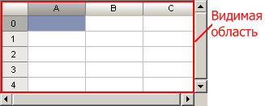

# ITabView.ConvertPtToView

ITabView.ConvertPtToView
-

# ITabView.ConvertPtToView

## Синтаксис

ConvertPtToView(PtInPix: [IGxPoint](ModDrawing.chm::/Interface/IGxPoint/IGxPoint.htm)):
 [IGxPointF](ModDrawing.chm::/Interface/IGxPointF/IGxPointF.htm);

## Параметры

PtInPix. Экранная точка.

## Описание

Метод ConvertPtToView осуществляет
 преобразование точки в экранных координатах в точку относительно левого
 верхнего угла видимой области электронной таблицы.

## Комментарии

Видимой областью электронной таблицы считается вся таблица, за исключением
 полос прокрутки:

## Пример

Для выполнения примера предполагается наличие формы, расположенного
 на ней компонента TabSheetBox с идентификатором «TabSheetBox1» и компонента
 UiTabSheet с наименованием «UiTabSheet1», являющегося источником данных
 для TabSheetBox. Приведенная ниже процедура является обработчиком события
 [OnMouseMove](ModForms.chm::/Interface/IControl/IControl.OnMouseMove.htm)
 (перемещение пользователем курсора мыши над компонентом) для «TabSheetBox1».

	Sub TabSheetBox1OnMouseMove(Sender: Object; Args: IMouseEventArgs);

	Var

	    TabSheet: ITabSheet;

	    TabView: ITabView;

	    Point: IGxPoint;

	    PointF: IGxPointF;

	Begin

	    TabSheet := UiTabSheet1.TabSheet;

	    TabView := TabSheet.View;

	    Point := New GxPoint.Create(Args.pPoint.X, Args.pPoint.Y);

	    PointF := TabView.ConvertPtToView(Point);

	    If PointF.X = 0 Then

	        WinApplication.InformationBox("Вы пересекли левую границу электронной таблицы");

	    End If;

	    If PointF.Y = 0 Then

	        WinApplication.InformationBox("Вы пересекли верхнюю границу электронной таблицы");

	    End If;

	End Sub TabSheetBox1OnMouseMove;

Пример будет выполняться, если пользователь перемещает курсор мыши над
 электронной таблицей («TabSheetBox1»). Если курсор мыши пересечет ее левую
 или верхнюю границу, то будет отображено соответствующее информационное
 сообщение.

См. также:

[ITabView](ITabView.htm)

		Справочная
		 система на версию 10.9
		 от 18/08/2025,
		 © ООО «ФОРСАЙТ»,
