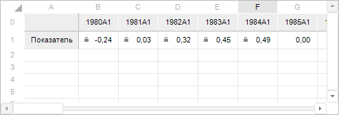

# ITabView.DisplayAccessRights

ITabView.DisplayAccessRights
-

# ITabView.DisplayAccessRights

## Синтаксис

DisplayAccessRights: Boolean;

## Описание

Свойство DisplayAccessRights
 определяет, отображать ли пиктограммы (), обозначающие
 наличие прав на доступ к данным.

## Комментарии

Допустимые значения:

	- True. По умолчанию.
	 Пиктограммы прав доступа будут отображены;

	- False. Пиктограммы прав
	 доступа не будут отображены.

Для получения подробной информации об отображении прав доступа к данным
 в виде пиктограмм обратитесь к разделу «[Отображение
 прав доступа к данным в виде пиктограмм](UiAnalyticalArea.chm::/TableView/Formatting/Cells_icons.htm)».

## Пример

Для выполнения примера предполагается наличие формы, расположенного
 на ней компонента Button с наименованием «Button1», компонента TabSheetBox
 с наименованием «TabSheetBox1» и компонента UiReport с наименованием «UiReport1»,
 являющегося источником данных для TabSheetBox. К «UiReport1» должен быть
 подключен регламентный отчет.

Добавьте ссылки на системные сборки: Tab, Report, Forms.

Пример будет выполняться при нажатии на кнопку.

	Sub Button1OnClick(Sender: Object; Args: IMouseEventArgs);

	Var

	    Report: IPrxReport;

	    TabView: ITabView;

	Begin

	    //Активируем компонент для получения доступа к данным

	    UiReport1.Active:=True;

	    //Определим регламентный отчет, подключенный к компоненту

	    Report := UiReport1.Report;

	    //Получим представление электронной таблицы

	    TabView := (Report.ActiveSheet As IPrxTable).TabSheet.View;

	    //Включим отображение пиктограмм прав доступа

	    TabView.DisplayAccessRights := True;

	End Sub Button1OnClick;

В результате выполнения примера на форме отобразится таблица с данными.
 В ячейках будут показаны пиктограммы прав доступа (),
 если у пользователя нет прав на редактирование данных в этих ячейках.

См. также:

[ITabView](ITabView.htm)
 | [IPrxReport](KeReport.chm::/Interface/IPrxReport/IPrxReport.htm)

		Справочная
		 система на версию 10.9
		 от 18/08/2025,
		 © ООО «ФОРСАЙТ»,
