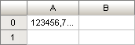
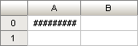

# ITabView.DisplayNumberSigns

ITabView.DisplayNumberSigns
-

# ITabView.DisplayNumberSigns

## Синтаксис

DisplayNumberSigns: Boolean;

## Описание

Свойство DisplayNumberSigns
 определяет способ отображения не текстовых данных, длина которых выходит
 за границы ячейки.

## Комментарии

Допустимые значения:

	- True. Значение по умолчанию.
	 При возникновении ситуации, когда часть значения не помещается в область
	 ячейки, все значение будет заменено знаками «#»;

	- False. Часть значения,
	 которая не помещается в область ячейки, будет заменена многоточием.

Данное свойство будет сохранено, независимо от того, был ли сохранен
 объект после изменения.

Примечание.
 Свойство влияет на отображение только не текстовых данных.

## Пример

	DisplayNumberSigns := False;

	DisplayNumberSigns := True;

См. также:

[ITabView](ITabView.htm)

		Справочная
		 система на версию 10.9
		 от 18/08/2025,
		 © ООО «ФОРСАЙТ»,
