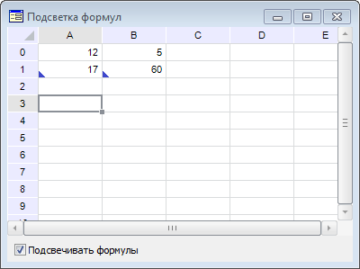

# ITabView.HighlightFormulas

ITabView.HighlightFormulas
-

# ITabView.HighlightFormulas

## Синтаксис

HighlightFormulas: Boolean;

## Описание

Свойство HighlightFormulas определяет,
 подсвечиваются ли в таблице ячейки с формулами.

## Комментарии

Если для свойства установлено значение True,
 ячейки с формулами подсвечиваются. Подсветка представляет собой синий
 треугольник в левом нижнем углу ячейки. По умолчанию установлено значение
 False, то есть ячейки с формулами
 не подсвечиваются.

## Пример

Для выполнения примера создайте форму и разместите на ней следующие
 компоненты:

	- TabSheetBox с наименованием «TabSheetBox1»;

	- CheckBox с наименованием «CheckBox1»;

	- UiTabSheet c наименованием «UiTabSheet1». Компонент UiTabSheet
	 является источником данных для компонента TabSheetBox.

Подключите ссылку на системную сборку Tab.

Добавьте обработчик события установки/снятия
 флажка:

	Sub CheckBox1OnChange(Sender: Object; Args: IEventArgs);

	Begin

	     UiTabSheet1.TabSheet.View.HighlightFormulas := CheckBox1.Checked;

	End Sub CheckBox1OnChange;

После выполнения примера при установке
 флажка ячейки, содержащие формулы, будут подсвечиваться.

На рисунке ниже в ячейках A0 и B0 содержатся
 простые значения, а в ячейках A1 и B1 - формулы «A0+B0» и «A0*B0». Ячейки
 A1 и B1 подсвечиваются:

См. также:

[ITabView](ITabView.htm)

		Справочная
		 система на версию 10.9
		 от 18/08/2025,
		 © ООО «ФОРСАЙТ»,
