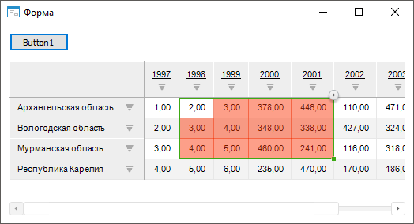

# ITabView.SelectionBorderColor

ITabView.SelectionBorderColor
-

# ITabView.SelectionBorderColor

## Синтаксис

SelectionBorderColor: [IGxColor](ModDrawing.chm::/Interface/IGxColor/IGxColor.htm);

## Описание

Свойство SelectionBorderColor
 определяет цвет границы выделенных ячеек таблицы.

## Комментарии

При определении цвета границы выделенных ячеек таблицы с помощью конструктора
 [GxColor.CreateARGB](ModDrawing.chm::/Class/GxColor/GxColor.CreateARGB.htm)
 не учитывается заданная степень прозрачности цвета.

Для определения цвета заливки выделенных ячеек таблицы используйте свойство
 [ITabView.SelectionColor](ITabView.SelectionColor.htm).

По умолчанию параметры оформления выделенных ячеек таблицы заданы в
 [настройках
 репозитория](UiNav.chm::/02_Navigator/Repo_Default.htm)
 на вкладке «[Оформление в отчетах](UiNav.chm::/02_Navigator/Repo_Default.htm#design)» или с помощью свойств [IDefaultBehaviour.SelectionBorderColor](KeFore.chm::/Interface/IDefaultBehaviour/IDefaultBehaviour.SelectionBorderColor.htm),
 [IDefaultBehaviour.SelectionColor](KeFore.chm::/Interface/IDefaultBehaviour/IDefaultBehaviour.SelectionColor.htm).

## Пример

Для выполнения примера предполагается наличие формы с набором компонентов:

	- [Button](UiDevEnv.chm::/02_Components_constructor_forms/01_Standart_Components/Button.htm). Компонент,
	 реализующий кнопку, с наименованием «Button1»;

	- [UiErAnalyzer](UiDevEnv.chm::/02_Components_constructor_forms/03_Components_of_the_access_to_data/UiErAnalyzer.htm).
	 Компонент, являющийся источником данных для компонента TabSheetBox, с наименованием «UiErAnalyzer1».
	 Выберите для компонента экспресс-отчёт с таблицей в свойстве Object;

	- [TabSheetBox](UiDevEnv.chm::/02_Components_constructor_forms/03_Components_of_the_access_to_data/TabSheetBox.htm).
	 Компонент, отображающий таблицу, с наименованием «TabSheetBox1». Выберите
	 для компонента источник данных «UiErAnalyzer1» в свойстве Source.

Добавьте ссылки на системные сборки: Drawing, Express, Forms, Tab.

			Sub Button1OnClick(Sender: Object; Args: IMouseEventArgs);

Var

    Express: IEaxAnalyzer;

    Grid: IEaxGrid;

    Tab: ITabSheet;

    TabView: ITabView;

Begin

    // Получим экспресс-отчёт

    UiErAnalyzer1.Active := True;

    Express := UiErAnalyzer1.ErAnalyzer;

    // Получим таблицу

    Grid := Express.Grid;

    Tab := Grid.TabSheet;

    // Получим представление таблицы

    TabView := Tab.View;

    // Зададим цвет границы выделенных ячеек
 таблицы

    TabView.SelectionBorderColor := New GxColor.CreateRGB(60, 170, 20);

    // Зададим цвет заливки выделенных ячеек
 таблицы

    TabView.SelectionColor := New GxColor.CreateARGB(120, 250, 50, 5);

End Sub Button1OnClick;

После нажатия на кнопку будет изменено оформление выделенных ячеек таблицы
 по заданным параметрам цвета границы и цвета заливки:

См. также:

[ITabView](ITabView.htm)

		Справочная
		 система на версию 10.9
		 от 18/08/2025,
		 © ООО «ФОРСАЙТ»,
