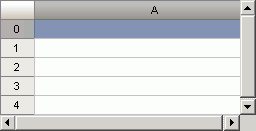

# ITabView.Size

ITabView.Size
-

# ITabView.Size

## Синтаксис

Size: [IGxSizeF](ModDrawing.chm::/Interface/IGxSizeF/IGxSizeF.htm);

## Описание

Свойство Size возвращает размер
 видимой области электронной таблицы в миллиметрах.

## Комментарии

Видимой областью электронной таблицы считается вся таблица, за исключением
 полос прокрутки:

## Пример

Для выполнения примера предполагается наличие формы, расположенной на
 ней кнопки с наименованием «Button1», компонента TabSheetBox и компонента
 UiTabSheet с наименованием «UiTabSheet1», являющегося источником данных
 для TabSheetBox.

	Sub Button1OnClick(Sender: Object; Args: IMouseEventArgs);

	Var

	    TabSheet: ITabSheet;

	    TabView: ITabView;

	    SizeF: IGxSizeF;

	Begin

	    TabSheet := UiTabSheet1.TabSheet;

	    TabView := TabSheet.View;

	    SizeF := TabView.Size;

	    TabSheet.ColumnWidth(0) := SizeF.Width;

	End Sub Button1OnClick;

После выполнения примера ширина первой колонки электронной таблицы будет
 равна ширине видимой области.

См. также:

[ITabView](ITabView.htm)

		Справочная
		 система на версию 10.9
		 от 18/08/2025,
		 © ООО «ФОРСАЙТ»,
