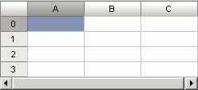

# ITabView.VisibleScrollBars

ITabView.VisibleScrollBars
-

# ITabView.VisibleScrollBars

## Синтаксис

VisibleScrollBars: [TabViewScrollBars](../../Enums/TabViewScrollBars.htm);

## Описание

Свойство VisibleScrollBars определяет
 видимость горизонтальной и вертикальной полос прокрутки таблицы.

## Комментарии

Значение по умолчанию [TabViewScrollBars.Both](../../Enums/TabViewScrollBars.htm)
 (отображаются обе полосы прокрутки).

## Пример

Для выполнения примера предполагается наличие формы, расположенной на
 ней кнопки с наименованием «Button1»,
 компонента TabSheetBox и компонента
 UiTabSheet с наименованием «UiTabSheet1», являющегося источником
 данных для TabSheetBox.

	Sub Button1OnClick(Sender: Object; Args: IMouseEventArgs);

	Var

	    TabSheet: ITabSheet;

	    TabView: ITabView;

	Begin

	    TabSheet := UiTabSheet1.TabSheet;

	    TabView := TabSheet.View;

	    TabView.VisibleScrollBars := TabViewScrollBars.Horizontal;

	End Sub Button1OnClick;

После выполнения примера будет отображаться только горизонтальная полоса
 прокрутки:

См. также:

[ITabView](ITabView.htm)

		Справочная
		 система на версию 10.9
		 от 18/08/2025,
		 © ООО «ФОРСАЙТ»,
