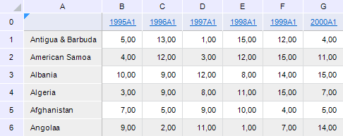

# Настройка сортировки

Настройка сортировки
-

# Настройка сортировки

Для работы с объектами в таблице предназначен интерфейс [ITabCustomSort](../Interface/ITabCustomSort/ITabCustomSort.htm).

Приведен пример настройки сортировки по убыванию по столбцу «C» в регламентном
 отчете с идентификатором «REPORT_TAB». Отчет содержит аналитическую область
 данных.

В результате таблица будет выглядеть следующим образом:

## Пример

Для выполнения примера добавьте ссылки на системные сборки: Metabase,
 Report, Tab.

			Sub TableView;

Var

    mb: IMetabase;

    Report: IPrxReport;

    Table: ITabSheet;

    CustomSort: ITabCustomSort;

    Sort: ITabCustomSortItem;

Begin

    // Получаем текущий репозиторий

    mb := MetabaseClass.Active;

    // Получаем регламентный отчет

    Report := mb.ItemById("REPORT_TAB").Edit As IPrxReport;

    // Получаем таблицу

    Table := (Report.ActiveSheet As IPrxTable).TabSheet;

    // Получаем параметры сортировки

    CustomSort := Table.CustomSort;

    // Очищаем текущие настройки сортировки

    CustomSort.Clear;

    // Задаем диапазон сортировки

    CustomSort.Range := Table.Regions.Item(0).Range;

    // Указываем, что сортировка будет выполняться по столбцу C

    CustomSort.Add(Table.ColumnIndex("C"));

    // Задаем параметры сортировки

    Sort := CustomSort.Item(0);

    // Указываем, что сортировка выполняется по убыванию

    Sort.Direction := TabCustomSortDirection.Descending;

    // Указываем, что выполняется сортировка числовых значений

    Sort.Type := TabCustomSortType.Value;

    // Выполняем сортировку

    CustomSort.Sort;

    // Сохраняем изменения

    (Report As IMetabaseObject).Save;

End Sub TableView;

См. также:

[Общие
 принципы программирования с использованием сборки Tab](Programming_principles.htm)

		Справочная
		 система на версию 10.9
		 от 18/08/2025,
		 © ООО «ФОРСАЙТ»,
