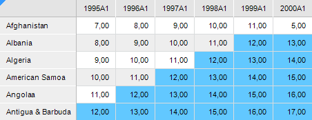

# Применение условного форматирования

Применение условного форматирования
-

# Применение условного форматирования

Для настройки условного форматирования данных в таблице предназначен
 интерфейс [ITabFormatConditions](Hierarchy/ITabFormatConditions.htm).

Приведен пример настройки условного форматирования в регламентном отчете
 с идентификатором «REPORT_TAB». Отчет содержит аналитическую область данных.

Будут выделены ячейки, содержащие значение выше среднего. В результате
 таблица будет выглядеть следующим образом:

## Пример

Для выполнения примера добавьте ссылки на системные сборки: Drawing,
 Metabase, Report, Tab.

			Sub CondFormat;

Var

    mb: IMetabase;

    Report: IPrxReport;

    Table: ITabSheet;

    TabConds: ITabFormatConditions;

    FormatCond: ITabFormatCondition;

    Average: ITabFormatAverage;

    Style: ITabCellStyle;

    Color: IGxColor;

Begin

    // Получаем текущий репозиторий

    mb := MetabaseClass.Active;

    // Получаем регламентный отчет

    Report := mb.ItemById("REPORT_TAB").Edit As IPrxReport;

    // Получаем таблицу

    Table := (Report.ActiveSheet As IPrxTable).TabSheet;

    // Получаем коллекцию условий условного форматирования

    TabConds := Table.FormatConditions;

    // Очищаем коллекцию условий

    TabConds.Clear;

    // Создаем новое условие

    FormatCond := TabConds.Add;

    // Задаем диапазон, для которого предназначен стиль таблицы

    FormatCond.Range := Table.Regions.Item(0).Range;

    // Указываем, что условие действующее

    FormatCond.Enabled := True;

    // Задаем тип условия: ячейки со значениями больше/меньше среднего

    FormatCond.Type := TabConditionType.Average;

    // Настраиваем условие

    Average := FormatCond.Details As ITabFormatAverage;

    // Задаем условие: форматировать ячейки со значением выше среднего

    Average.Type := TabFormatAverageType.Above;

    // Задаем стиль оформления фона ячеек, удовлетворяющих условию

    Style := New TabCellStyle.Create;

    Color := New GxColor.CreateRGB(98, 200, 255);

    Style.BackgroundColor := Color;

    Average.Style := Style;

    // Сохраняем изменения

    (Report As IMetabaseObject).Save;

End Sub CondFormat;

См. также:

[Общие
 принципы программирования с использованием сборки Tab](Programming_principles.htm)

		Справочная
		 система на версию 10.9
		 от 18/08/2025,
		 © ООО «ФОРСАЙТ»,
