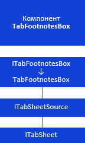

# Компонент TabFootnotesBox: иерархия интерфейсов

Компонент TabFootnotesBox: иерархия интерфейсов
-

# Компонент TabFootnotesBox

Компонент TabFootnotesBox предназначен
 для отображения сносок в таблице данных.

[Условные обозначения](javascript:TextPopup(this))

			 Обозначение

			 Расшифровка

			 

			 Класс_1 является потомком Интерфейса_1.

			 

			 Интерфейс_2 является потомком Интерфейса_1.

			 

			 Интерфейс_2 можно получить, используя
			 свойства, методы Интерфейса_1.

Примечание.
 На схеме все названия групп, интерфейсов и классов являются гиперссылками,
 для перехода к их подробному описанию щелкните по ним мышью.

Компонент имеет следующую иерархию:

[

См. также:

Иерархия сборки Tab](../../Interface/ITabSheet/ITabSheet.htm)
 | [Компоненты сборки Tab](TabSheet_Components.htm)

		Справочная
		 система на версию 10.9
		 от 18/08/2025,
		 © ООО «ФОРСАЙТ»,
