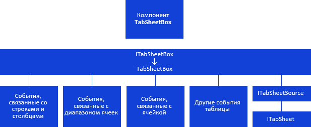
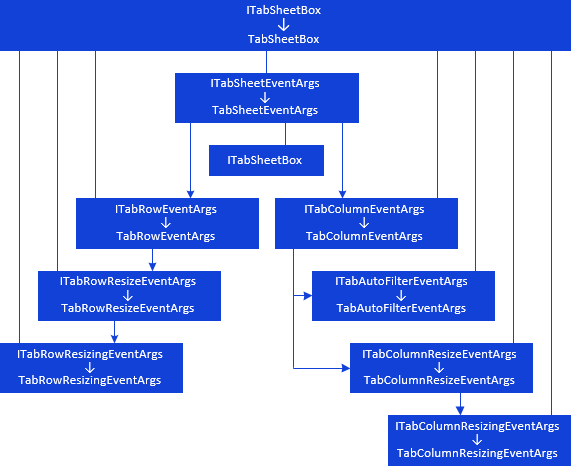
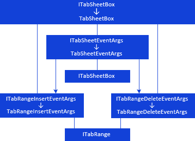
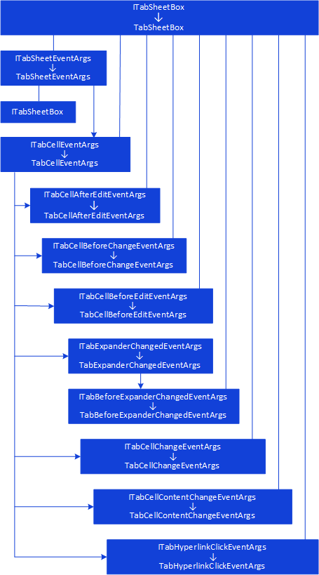
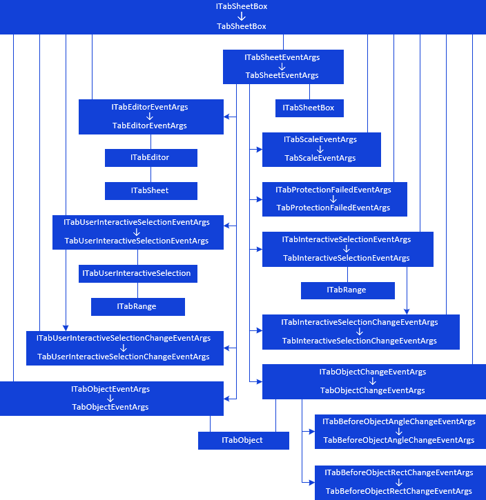

# Компонент TabSheetBox: иерархия интерфейсов

Компонент TabSheetBox: иерархия интерфейсов
-

# Компонент TabSheetBox

Компонент [TabSheetBox](UiDevEnv.chm::/02_Components_constructor_forms/03_Components_of_the_access_to_data/TabSheetBox.htm) предназначен
 для визуального отображения таблиц.

[Условные обозначения](javascript:TextPopup(this))

			 Обозначение

			 Расшифровка

			 

			 Класс_1 является потомком Интерфейса_1.

			 

			 Интерфейс_2 является потомком Интерфейса_1.

			 

			 Интерфейс_2 можно получить, используя
			 свойства, методы Интерфейса_1.

Примечание.
 На схеме все названия групп, интерфейсов и классов являются гиперссылками,
 для перехода к их подробному описанию щелкните по ним мышью.

Компонент имеет следующую иерархию:

[

## ](../../Interface/ITabSheetBox/ITabSheetBox.htm)События, связанные со строками и столбцами

События, связанные со строками и столбцами компонента [TabSheetBox](UiDevEnv.chm::/02_Components_constructor_forms/03_Components_of_the_access_to_data/TabSheetBox.htm),
 имеют следующую иерархию:

[

## ](../../Interface/ITabSheetBox/ITabSheetBox.htm)События, связанные с диапазоном ячеек

События, связанные с диапазоном ячеек компонента [TabSheetBox](UiDevEnv.chm::/02_Components_constructor_forms/03_Components_of_the_access_to_data/TabSheetBox.htm),
 имеют следующую иерархию:

[

## ](../../Class/TabSheetBox/TabSheetBox.htm)События, связанные с ячейкой

События, связанные с ячейкой компонента [TabSheetBox](UiDevEnv.chm::/02_Components_constructor_forms/03_Components_of_the_access_to_data/TabSheetBox.htm),
 имеют следующую иерархию:

[

## ](../../Interface/ITabSheetBox/ITabSheetBox.htm)Другие события таблицы

Другие события, связанные с компонентом [TabSheetBox](UiDevEnv.chm::/02_Components_constructor_forms/03_Components_of_the_access_to_data/TabSheetBox.htm),
 имеют следующую иерархию:

[

См. также:

Иерархия сборки Tab](../../Interface/ITabSheetBox/ITabSheetBox.htm)
 | [Компоненты сборки Tab](TabSheet_Components.htm)

		Справочная
		 система на версию 10.9
		 от 18/08/2025,
		 © ООО «ФОРСАЙТ»,
