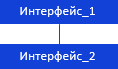
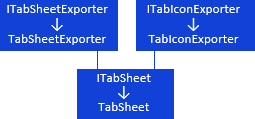

# Различные задачи: иерархия интерфейсов

Различные задачи: иерархия интерфейсов
-

# Различные задачи

В данном разделе приведена иерархия интерфейсов, предназначенных для
 решения различных задач.

[Условные обозначения](javascript:TextPopup(this))

			 Обозначение

			 Расшифровка

			 

			 Класс_1 является потомком Интерфейса_1.

			 

			 Интерфейс_2 является потомком Интерфейса_1.

			 

			 Интерфейс_2 можно получить, используя
			 свойства, методы Интерфейса_1.

Примечание.
 На схеме все названия групп, интерфейсов и классов являются гиперссылками,
 для перехода к их подробному описанию щелкните по ним мышью.

	- Обработка исключительных ситуаций:

[

	- Экспорт таблицы и её элементов:

	- Работа с диаграммой регламентного отчета:

	- Настройка панели для работы со сносками:

См. также:

Иерархия сборки Tab](../../Interface/ITabNotNumberException/ITabNotNumberException.htm)

		Справочная
		 система на версию 10.9
		 от 18/08/2025,
		 © ООО «ФОРСАЙТ»,
