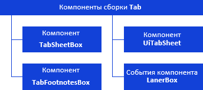

# Компоненты сборки Tab: иерархия интерфейсов

Компоненты сборки Tab: иерархия интерфейсов
-

# Компоненты сборки Tab

В сборке Tab содержатся классы
 и интерфейсы для работы со следующими компонентами:

[

Примечание.
 На схеме все названия групп, интерфейсов и классов являются гиперссылками,
 для перехода к их подробному описанию щелкните по ним мышью.

См. также:

Иерархия сборки Tab](Component_TabSheetBox.htm)

		Справочная
		 система на версию 10.9
		 от 18/08/2025,
		 © ООО «ФОРСАЙТ»,
