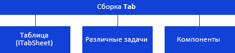

# Иерархия сборки Tab

Иерархия сборки Tab
-

# Иерархия сборки Tab

Все классы и интерфейсы сборки Tab
 можно разделить на группы, приведенные ниже.

[

Примечание.
 На схеме все названия групп, интерфейсов и классов являются гиперссылками,
 для перехода к их подробному описанию щелкните по ним мышью.

См. также:

Введение](TabSheet_Components.htm)

		Справочная
		 система на версию 10.9
		 от 18/08/2025,
		 © ООО «ФОРСАЙТ»,
