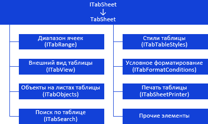

# Таблица: иерархия интерфейсов

Таблица: иерархия интерфейсов
-

# Таблица

В сборке Tab таблица реализована
 интерфейсом [ITabSheet](../../Interface/ITabSheet/ITabSheet.htm).
 Все интерфейсы, предназначенные для настройки параметров таблицы,
 можно разделить на следующие группы:

[

Примечание.
 На схеме все названия групп, интерфейсов и классов являются гиперссылками,
 для перехода к их подробному описанию щелкните по ним мышью.

См. также:

Иерархия сборки Tab](../../Interface/ITabSheet/ITabSheet.htm)

		Справочная
		 система на версию 10.9
		 от 18/08/2025,
		 © ООО «ФОРСАЙТ»,
