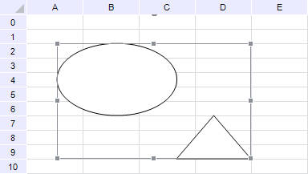

# Добавление объектов в таблицу

Добавление объектов в таблицу
-

# Добавление объектов в таблицу

Для работы с объектами в таблице предназначен интерфейс [ITabObjects](Hierarchy/ITabObjects.htm).

Приведен пример добавления и группировки двух фигур в регламентном отчете
 с идентификатором «REPORT_TAB».

Будут добавлены эллипс и треугольник, которые затем будут объединены
 в группу. В результате таблица будет выглядеть следующим образом:

## Пример

Для выполнения примера добавьте ссылки на системные сборки: Drawing,
 Metabase, Report, Tab.

			Sub Objects;

Var

    mb: IMetabase;

    Report: IPrxReport;

    Table: ITabSheet;

    Objs: ITabObjects;

    Obj, Obj1: ITabObject;

    Placement: IGxRectF;

Begin

    // Получаем текущий репозиторий

    mb := MetabaseClass.Active;

    // Получаем регламентный отчет

    Report := mb.ItemById("REPORT_TAB").Edit As IPrxReport;

    // Получаем таблицу

    Table := (Report.ActiveSheet As IPrxTable).TabSheet;

    // Получаем коллекцию объектов отчета

    Objs := Table.Objects;

    // Очищаем коллекцию

    Objs.Clear;

    // Задаем расположение первого объекта

    Placement := New GxRectF.Create(10, 10, 50, 35);

    // Добавляем первый объект в коллекцию

    Obj := Objs.Add("PrxShape", Placement);

    // Задаем текст всплывающей подсказки для первого объекта

    Obj.Tooltip := "Эллипс";

    // Указываем тип первого объекта - эллипс

    (Obj As iprxShape).Type := PrxShapeType.Ellipse;

    // Задаем расположение второго объекта

    Placement := New GxRectF.Create(50, 35, 75, 50);

    // Добавляем второй объект в коллекцию

    Obj1 := Objs.Add("PrxShape", Placement);

    // Задаем текст всплывающей подсказки для второго объекта

    Obj1.Tooltip := "Треугольник";

    // Указываем тип второго объекта - треугольник

    (Obj1 As iprxShape).Type := PrxShapeType.Triangle;

    // Выделяем оба объекта

    Obj.Select_;

    Obj1.Select_;

    // Объединяем выделенные объекты в группу

    Objs.GroupSelected;

    // Сохраняем изменения

    (Report As IMetabaseObject).Save;

End Sub Objects;

См. также:

[Общие
 принципы программирования с использованием сборки Tab](Programming_principles.htm)

		Справочная
		 система на версию 10.9
		 от 18/08/2025,
		 © ООО «ФОРСАЙТ»,
