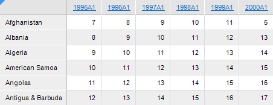

# Поиск данных

Поиск данных
-

# Поиск данных

Для поиска данных в таблице предназначен интерфейс [ITabSearch](Hierarchy/ITabSearch.htm).

Приведен пример поиска данных в регламентном отчете с идентификатором
 «REPORT_TAB». Отчет содержит аналитическую область данных. Результаты
 поиска будут выведены в окно консоли.

Предположим, отчет «REPORT_TAB» содержит следующую аналитическую
 область данных:

В окно консоли будут выведены следующие результаты:

Выполняем поиск текста «12» по всем ячейкам таблицы

    Адрес: найденный текст

    F2: 12

    E3: 12

    D4: 12

    C5: 12

    B6: 12

Выполняем поиск текста «1» в 4-м столбце таблицы

    Адрес: найденный текст

    E0: 1998A1

    E1: 10

    E2: 11

    E3: 12

    E4: 13

    E5: 14

    E6: 15

Выполняем поиск текста «0» в 3-й строке таблицы

    Адрес: найденный текст

    D2: 10

## Пример

Для выполнения примера добавьте ссылки на системные сборки: Metabase,
 Report, Tab.

			// Процедура поиска

Sub Search;

Var

    mb: IMetabase;

    Report: IPrxReport;

    Table: ITabSheet;

    CellSearch: ITabCellSearch;

    Result: ITabSearchResult;

    RowSearch: ITabRowSearch;

    ColumnSearch: ITabColumnSearch;

Begin

    // Получаем текущий репозиторий

    mb := MetabaseClass.Active;

    // Получаем регламентный отчет

    Report := mb.ItemById("REPORT_TAB").Bind As IPrxReport;

    // Получаем таблицу

    Table := (Report.ActiveSheet As IPrxTable).TabSheet;

    // Создаем объект для поиска по всем ячейкам

    CellSearch := Table.CreateCellSearch;

    // Задаем диапазон поиска данных

    CellSearch.Range := Table.Regions.Item(0).Range;

    // Указываем, что не учитываем регистр при поиске

    CellSearch.CaseSensitive := False;

    // Указываем направление поиска: по строкам

    CellSearch.Direction := TabCellSearchDirection.Rows;

    // Указываем, что поиск будет выполняться по части слова

    CellSearch.WholeWordsOnly := False;

    // Указываем, что поиск будет выполняться по тексту ячейки

    CellSearch.Target := TabCellSearchTarget.Text;

    // Задаем текст поиска

    CellSearch.Text := "12";

    // Выполняем поиск

    Result := CellSearch.Execute;

    // Выводим результаты в окно консоли

    Debug.WriteLine("Выполняем поиск текста «12» по всем ячейкам таблицы");

    PrintResult(Result);

    // Создаем объект для поиска по строкам

    RowSearch := Table.CreateRowSearch;

    // Задаем условие поиска: поиск в 4-м столбце
 части текста «1» без учета регистра

    RowSearch.AddCondition(4, "1", False, False);

    // Выполняем поиск

    Result := RowSearch.Execute;

    // Выводим результаты в окно консоли

    Debug.WriteLine("Выполняем поиск текста «1» в 4-м столбце
 таблицы");

    PrintResult(Result);

    // Создаем объект для поиска по столбцам

    ColumnSearch := Table.CreateColumnSearch;

    // Задаем условие поиска: поиск в 3-й строке
 части текста «0» без учета регистра

    ColumnSearch.AddCondition(3, "0", False, False);

    // Выполняем поиск

    Result := ColumnSearch.Execute;

    // Выводим результаты в окно консоли

    Debug.WriteLine("Выполняем поиск текста «0» в 3-й строке таблицы");

    PrintResult(Result);

End Sub Search;

// Процедура для вывода результатов поиска

Sub PrintResult(Result: ITabSearchResult);

Var

    Range: ITabRange;

Begin

    If Result <> Null

    Then

        Debug.WriteLine("    Адрес: найденный текст");

        Repeat

            Range := Result.Range;

            Debug.WriteLine("    " + Range.Address + ": " + Range.Text);

            If Not Result.Next Then

                Break;

            End If;

        Until False;

    Else

        Debug.WriteLine("    Текст, удовлетворяющий условиям поиска, не найден");

    End If;

End Sub PrintResult;

См. также:

[Общие
 принципы программирования с использованием сборки Tab](Programming_principles.htm)

		Справочная
		 система на версию 10.9
		 от 18/08/2025,
		 © ООО «ФОРСАЙТ»,
