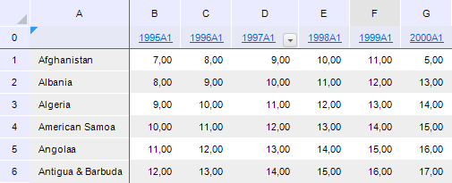

# Настройка внешнего вида таблицы

Настройка внешнего вида таблицы
-

# Настройка внешнего вида таблицы

Для настройки внешнего вида таблицы предназначен интерфейс [ITabView](Hierarchy/ITabView.htm).

Приведен пример настройки внешнего вида таблицы в регламентном отчете
 с идентификатором «REPORT_TAB». Отчет содержит аналитическую область данных.

Таблица до настройки:

Таблица после настройки:

## Пример

Для выполнения примера добавьте ссылки на системные сборки: Metabase,
 Report, Tab.

			Sub TableView;

Var

    mb: IMetabase;

    Report: IPrxReport;

    Table: ITabSheet;

    View: ITabView;

    Filter: ITabAutoFilter;

    RCount: String;

Begin

    // Получаем текущий репозиторий

    mb := MetabaseClass.Active;

    // Получаем регламентный отчет

    Report := mb.ItemById("REPORT_TAB").Edit As IPrxReport;

    // Получаем таблицу

    Table := (Report.ActiveSheet As IPrxTable).TabSheet;

    // Получаем объект, определяющий внешний вид таблицы

    View := Table.View;

    // Создаем автофильтр на столбце D

    Filter := View.AutoFilter;

    RCount := (Table.RowsCount - 1).ToString;

    Filter.Range := Table.ParseRange("D0:D" + RCount);

    Filter.Enabled := True;

    // Увеличиваем ширину столбца D

    Table.ColumnPixelWidth(3) := 75;

    // Зафиксируем первую строку и первый столбец

    View.FixedColumnsCount := 1;

    View.FixedRowsCount := 1;

    // Изменим высоту и ширину заголовка столбцов

    View.ColumnsHeaderHeight := 8;

    View.RowsHeaderWidth := 8;

    // Выключаем отображение сетки

    View.DisplayGrid := False;

    // Сохраняем изменения

    (Report As IMetabaseObject).Save;

End Sub TableView;

См. также:

[Общие
 принципы программирования с использованием сборки Tab](Programming_principles.htm)

		Справочная
		 система на версию 10.9
		 от 18/08/2025,
		 © ООО «ФОРСАЙТ»,
