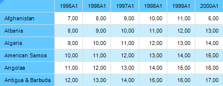

# Настройка стиля таблицы

Настройка стиля таблицы
-

# Настройка стиля таблицы

Для настройки стиля таблицы предназначен интерфейс [ITabTableStyles](Hierarchy/ITabTableStyles.htm).

Приведен пример изменения стиля таблицы в регламентном отчете с идентификатором
 «REPORT_TAB». Отчет содержит аналитическую область данных.

В результате таблица будет выглядеть следующим образом:

## Пример

Для выполнения примера добавьте ссылки на системные сборки: Drawing,
 Metabase, Report, Tab.

			Sub TableStyle;

Var

    mb: IMetabase;

    Report: IPrxReport;

    Table: ITabSheet;

    Styles: ITabTableStyles;

    TableStyle: ITabTableStyle;

    Style: ITabCellStyle;

    Color: IGxColor;

    TStripe: ITabTableStripe;

Begin

    // Получаем текущий репозиторий

    mb := MetabaseClass.Active;

    // Получаем регламентный
 отчет

    Report := mb.ItemById("REPORT_TAB").Edit As IPrxReport;

    // Получаем таблицу

    Table := (Report.ActiveSheet As IPrxTable).TabSheet;

    // Получаем стили таблицы

    Styles := Table.TableStyles;

    // Очищаем существующие стили

    Styles.Clear;

    // Добавляем новый стиль таблицы

    TableStyle := Styles.Add;

    // Задаем диапазон, для которого предназначен стиль таблицы

    TableStyle.Range := Table.Regions.Item(0).Range;

    // Задаем наименование стиля

    TableStyle.Name := "Стиль для таблицы 'Светло-синий'";

    // Создаем новый стиль

    Style := New TabCellStyle.Create;

    Color := New GxColor.CreateRGB(200, 238, 253);

    Style.BackgroundBrush := New GxSolidBrush.Create(Color);

    // Устанавливаем созданный стиль для оформления второй полосы строк в таблице

    TStripe := TableStyle.RowSecondStripe;

    TStripe.Style := Style;

    TStripe.Width := 1;

    // Меняем созданный стиль

    Color := New GxColor.CreateRGB(98, 200, 255);

    Style.BackgroundBrush := New GxSolidBrush.Create(Color);

    // Устанавливаем обновленный
 стиль для оформления первой строки и первого столбца

    TStripe := TableStyle.HeaderColumnStripe;

    TStripe.Style := Style;

    TStripe.Width := 1;

    TStripe := TableStyle.HeaderRowStripe;

    TStripe.Style := Style;

    TStripe.Width := 1;

    // Сохраняем изменения

    (Report As IMetabaseObject).Save;

End Sub TableStyle;

См. также:

[Общие
 принципы программирования с использованием сборки Tab](Programming_principles.htm)

		Справочная
		 система на версию 10.9
		 от 18/08/2025,
		 © ООО «ФОРСАЙТ»,
