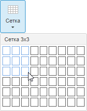
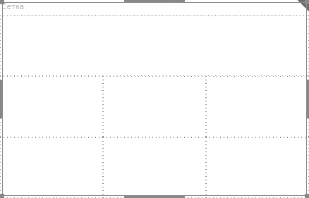

# Вставка сетки и работа с ней

Вставка сетки и работа с ней
-

# Вставка сетки и работа с ней

Сетка - элемент-контейнер, представляющий собой набор ячеек в виде таблицы.
 Каждая ячейка является контейнером для размещения объектов аналитической
 панели.

Для вставки сетки используйте:

	- команду «Сетка» в раскрывающемся
	 меню кнопки «Контейнеры» на
	 вкладке ленты «Главная»;

	- кнопку «Сетка» в группе
	 «Контейнеры» на вкладке ленты
	 «Главная»;

	- команду «Сетка» в раскрывающемся
	 меню пункта «Новый блок» в
	 контекстном меню аналитической панели.

Будет отображено раскрывающееся меню, в котором с помощью мыши укажите
 необходимое количество столбцов и строк в создаваемой сетке. Например:

Все ячейки в сетке создаются одинакового размера.

Операции с сеткой:

[Вставка строки](javascript:TextPopup(this))

	Выделите ячейку сетки и выполните команду в контекстном меню:

		- Вставить строку перед.
		 Вставка новой строки выше текущей ячейки;

		- Вставить строку после.
		 Вставка новой строки после текущей ячейки.

[Вставка столбца](javascript:TextPopup(this))

	Выделите ячейку сетки и выполните команду в контекстном меню:

		- Вставить столбец перед.
		 Вставка нового столбца слева от текущей ячейки;

		- Вставить столбец после.
		 Вставка нового столбца справа от текущей ячейки.

[Удаление строки/столбца](javascript:TextPopup(this))

	Выделите ячейку сетки и выполните команду в контекстном меню:

		- Удалить столбцы.
		 Удаление столбца, содержащего текущую ячейку;

		- Удалить строки.
		 Удаление строки, содержащей текущую ячейку.

[Объединение
 ячеек](javascript:TextPopup(this))

	Несколько ячеек сетки можно объединить в одну, например, для создания
	 ячейки с общим заголовком.

	Для объединения ячеек:

		- выделите объединяемые ячейки;

		- выполните команду «Объединить»
		 в контекстном меню.

	Ячейки будут объединены.

	Важно.
	 При объединении данные сохраняются только в верхней левой ячейке.
	 Содержимое остальных объединяемых ячеек будет удалено.

[Разъединение
 ячеек](javascript:TextPopup(this))

	Разъединение доступно, если ячейка объединенная или если в соседней
	 ячейке выполнено разбиение.

	Для разделения ячеек:

		- выделите разделяемую ячейку;

		- выполните команду «Разъединить»
		 в контекстном меню.

	Ячейка будет разделена. Данные, содержащиеся в разделяемой ячейке,
	 будут помещены в левую верхнюю ячейку.

[Разбиение ячейки](javascript:TextPopup(this))

	Для разбиения выделенной ячейки на несколько новых используйте команду
	 «Разбить ячейку» в контекстном
	 меню. Отобразится раскрывающееся меню, в котором с помощью мыши укажите
	 необходимое количество столбцов и строк.

	Примечание.
	 Объединенная ячейка не может быть разбита. Используйте разъединение
	 ячеек.

[Изменение размеров
 строк/столбцов](javascript:TextPopup(this))

	Для изменения размера строки:

		- наведите курсор мыши на границу строки. Указатель мыши должен
		 принять вид двунаправленной стрелки;

		- зажмите кнопку мыши и растяните или сожмите строку до необходимого
		 размера.

	Изменение размера столбца выполняется аналогичным образом.

[Настройка параметров
 ячейки/сетки](javascript:TextPopup(this))

	Для [настройки базовых
	 параметров](../Document/Block_BaseProps.htm) сетки и ячейки используйте вкладку «Блок»
	 на боковой панели.

Пример пустой сетки, содержащей объединенные элементы:

Если в ячейке размещен блок, то в его контекстном меню присутствует
 пункт «Сетка» с дочерним подменю,
 соответствующим контекстному меню элемента сетки.

См. также:

[Выбор
 элементов эскиза для компоновки панели](Create_markup.htm)

		Справочная
		 система на версию 10.9
		 от 18/08/2025,
		 © ООО «ФОРСАЙТ»,
