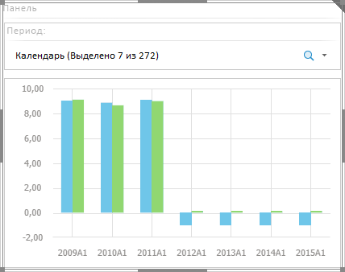

# Вставка панели и работа с ней

Вставка панели и работа с ней
-

# Вставка панели и работа с ней

Панель - одностраничный элемент-контейнер, позволяющий объединить в
 группу несколько объектов аналитической панели.

Для вставки панели используйте:

	- команду «Панель» в раскрывающемся
	 меню кнопки «Контейнеры» на
	 вкладке ленты «Главная»;

	- кнопку «Панель» в группе
	 «Контейнеры» на вкладке ленты
	 «Главная»;

	- команду «Панель» в раскрывающемся
	 меню пункта «Новый блок» в
	 контекстном меню аналитической панели.

Для [настройки базовых параметров](../Document/Block_BaseProps.htm)
 панели используйте вкладку «Блок»
 на боковой панели.

Пример панели, содержащей несколько блоков:

См. также:

[Выбор
 элементов эскиза для компоновки панели](Create_markup.htm)

		Справочная
		 система на версию 10.9
		 от 18/08/2025,
		 © ООО «ФОРСАЙТ»,
