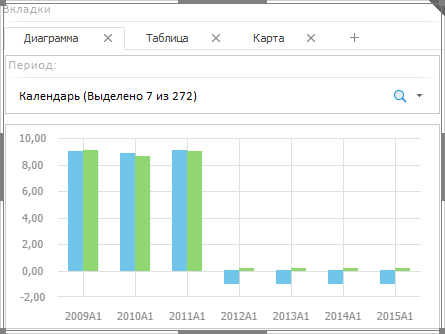

# Вставка вкладок и работа с ними

Вставка вкладок и работа с ними
-

# Вставка вкладок и работа с ними

Вкладки - многостраничный элемент-контейнер, позволяющий объединить
 в группу несколько объектов аналитической панели. При работе отображается
 содержимое только одной вкладки.

Для вставки вкладок используйте:

	- команду «Вкладки» в
	 раскрывающемся меню кнопки «Контейнеры»
	 на вкладке ленты «Главная»;

	- кнопку «Вкладки» в группе
	 «Контейнеры» на вкладке ленты
	 «Главная»;

	- команду «Вкладки» в
	 раскрывающемся меню пункта «Новый
	 блок» в контекстном меню аналитической панели.

Будет создан элемент-контейнер, содержащий одну вкладку.

Пример элемента:

Операции с элементом-контейнером «Вкладки»:

[Добавление вкладки](javascript:TextPopup(this))

	Нажмите на кнопку «+».

[Выделение вкладки](javascript:TextPopup(this))

	Для выделения активной вкладки щёлкните по пустому пространству
	 внутри неё. Для выделения неактивной вкладки щелкните по её наименованию.

[Удаление вкладки](javascript:TextPopup(this))

	Для удаления выделенной вкладки:

		- нажмите клавишу DELETE;

		- выполните команду «Удалить»
		 в контекстном меню.

[Переименование
 вкладки](javascript:TextPopup(this))

	Дважды щелкните по наименованию вкладки. Наименование будет переведено
	 в режим редактирования. Внесите требуемые изменения и нажмите клавишу
	 ENTER.

[Отображение/скрытие
 вкладок](javascript:TextPopup(this))

	Для отображения/скрытия вкладок используйте флажок «Показывать
	 закладки», расположенный:

		- в контекстном меню блока;

		- на вкладке «[Блок](../Document/Block_BaseProps.htm)»
		 боковой панели. Доступно только в веб-приложении.

	По умолчанию флажок установлен и отображаются все вкладки.

	Если флажок снят, то вкладки не отображаются. Для перехода между
	 вкладками используйте список «Выбрать
	 вкладку» в контекстном меню элемента.

[Переход между
 вкладками](javascript:TextPopup(this))

	Для перехода между вкладками:

		- щелкните по наименованию вкладки;

		- выберите требуемую вкладку в списке «Выбрать
		 вкладку» в контекстном меню элемента.

	Если наименования не всех вкладок помещаются в элементе-контейнере,
	 то отображаются дополнительные кнопки для навигации:

		- 
		 Прокручивает вкладки влево;

		- 
		 Отображает список всех вкладок. Для перехода к требуемой вкладке
		 щелкните по её наименованию;

		- 
		 Прокручивает вкладки вправо.

[Настройка параметров
 вкладок](javascript:TextPopup(this))

	Для [настройки базовых
	 параметров](../Document/Block_BaseProps.htm) вкладок и всего элемента контейнера используйте вкладку
	 «Блок» на боковой панели.

См. также:

[Выбор
 элементов эскиза для компоновки панели](Create_markup.htm)

		Справочная
		 система на версию 10.9
		 от 18/08/2025,
		 © ООО «ФОРСАЙТ»,
