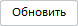
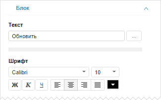
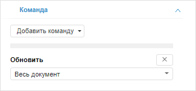
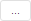
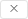

# Настройка кнопки

Настройка кнопки
-

# Настройка кнопки

Элемент управления «Кнопка»
 позволяет выполнять различные команды при нажатии на кнопку.

Для вставки кнопки используйте:

	- команду «Кнопка» в раскрывающемся
	 меню кнопки «Управление» на
	 вкладке «Главная» или «Вставка» ленты инструментов;

	- команду «Кнопка» в раскрывающемся
	 меню пункта «Новый блок > Управление»
	 в контекстном меню аналитической панели.

Элемент управления будет вставлен в рабочую область.

Пример элемента управления «Кнопка»:

Для настройки параметров блока используйте вкладки «Блок»
 и «Команда» на боковой панели.

[Для отображения
 вкладок](javascript:TextPopup(this))

		- Убедитесь, что боковая панель отображается.

		- Выделите блок на рабочей области.

		- Перейдите на требуемую вкладку.

## Настройка базовых параметров

Для настройки базовых параметров кнопки используйте вкладку «[Блок](../../Document/Block_BaseProps.htm)» на боковой
 панели:

Помимо параметров, доступных для всех объектов в аналитической панели,
 для кнопки также доступны дополнительные настройки:

	- Текст. Введите текст,
	 который должен отображаться на кнопке;

	- Шрифт.
	 Настройте параметры оформления текста кнопки: шрифт, выравнивание,
	 начертание и цвет.

[Параметры
 шрифта](javascript:TextPopup(this))

			- Шрифт. Выберите
			 один из шрифтов, установленных в операционной системе;

			- Размер шрифта.
			 Установите требуемый размер шрифта. Размер задаётся в пунктах,
			 и его можно выбрать из раскрывающегося списка или ввести вручную.
			 Диапазон допустимых значений: [1, 72];

			- Начертание текста.
			 Нажмите кнопки, задающие начертание шрифта:

				- Ж. Полужирное
				 начертание;

				- К. Курсивное
				 начертание;

				- Ч. Подчеркивание
				 текста.

	При нажатой кнопке будет использоваться
	 соответствующий стиль начертания. Доступно использование нескольких
	 стилей одновременно, например, нажатие кнопок «Ж»
	 и «К» даёт полужирное курсивное
	 начертание;

			- Выравнивание текста
			 заголовка. Задайте выравнивание заголовка относительно
			 объекта:

				-  По левому краю;

				-  По центру. По умолчанию;

				-  По правому краю;

				-  По ширине;

			- Цвет шрифта.
			 Выберите цвет шрифта в раскрывающейся палитре цветов. Для
			 установки нового цвета шрифта перейдите на вкладку «Спектр» в палитре цветов
			 и выберите цвет в расширенной палитре.

## Управление командами

Для управления действием, выполняемым при нажатии кнопки, используйте
 вкладку «Команда» на боковой панели:

Для добавления команды нажмите кнопку «Добавить
 команду». В раскрывающемся меню кнопки выберите необходимые команды,
 выполняемые при нажатии на кнопку, и задайте параметры команды:

[Показать/скрыть
 блок](javascript:TextPopup(this))

	Выберите из раскрывающегося списка объект, который будет показываться/скрываться.

[Показать
 блок](javascript:TextPopup(this))

	Выберите из раскрывающегося списка объект, который будет показываться.

[Скрыть
 блок](javascript:TextPopup(this))

	Выберите из раскрывающегося списка блок, который будет скрываться.

[Экспорт](javascript:TextPopup(this))

		- Выберите экспортируемый объект:
		 весь документ или отдельный блок.

		- Выберите из раскрывающегося
		 списка формат экспорта.

	В результате выполнения действий при нажатии на кнопку будет выполнен
	 экспорт требуемых блоков документа или всего документа в файл выбранного
	 формата.

	Совет. Для экспорта
	 нескольких блоков добавьте несколько команд «Экспорт».

	Подробное описание особенностей экспорта приведено в разделе «[Экспорт аналитической панели](../../Document/Export.htm)».

[Печать](javascript:TextPopup(this))

	Выберите из раскрывающегося списка объект, который будет напечатан
	 с предварительным открытием окна просмотра и настройки печати.

[Открыть
 отчет](javascript:TextPopup(this))

		- в веб-приложении:

			- Нажмите кнопку  «Обзор».

			- В открывшемся окне репозитория выберите необходимый
			 отчёт;

		- в настольном приложении выберите из раскрывающегося списка
		 отчёт, который будет открываться.

	В результате выполнения действий при нажатии на кнопку будет открыт
	 выбранный отчёт. Отчёт должен находиться в том же репозитории, что
	 и аналитическая панель.

	Для поиска отчётов в репозитории:

		- в веб-приложении введите текст для поиска в поле «Поиск» и нажмите кнопку ENTER;

		- в настольном приложении:

			- нажмите кнопку  «Поиск» и введите текст для
			 поиска;

			- введите текст для поиска, при этом фокус ввода должен
			 находиться в закрытом дереве объектов репозитория.

	По мере ввода строки в поле в списке
	 элементов будут отображаться только те объекты, наименования которых
	 содержат введенную строку.

[Открыть
 объект](javascript:TextPopup(this))

		- в веб-приложении:

			- Нажмите кнопку  «Обзор».

			- В открывшемся окне репозитория выберите необходимый
			 объект.

			- В раскрывающемся списке «Режим
			 открытия» выберите способ открытия объекта репозитория:
			 «Открыть» или «Редактировать». В зависимости
			 от типа объекта в раскрывающемся списке отображаются только
			 те режимы, которые доступны для выбранного объекта в навигаторе
			 объектов;

		- в настольном приложении:

			- В раскрывающемся списке «Открыть
			 объект» выберите объект, который будет открываться.
			 Объект должен содержаться в том же репозитории, что и аналитическая
			 панель.

			- В раскрывающемся списке «Режим
			 открытия» выберите способ открытия объекта репозитория:
			 «Открыть» или «Редактировать». В зависимости
			 от типа объекта в раскрывающемся списке отображаются только
			 те режимы, которые доступны для выбранного объекта в навигаторе
			 объектов.

	В результате выполнения действий при нажатии на кнопку будет открыт
	 выбранный объект репозитория в заданном режиме. Объект должен находиться
	 в том же репозитории, что и аналитическая панель.

	Для поиска объектов в репозитории:

		- в веб-приложении введите текст для поиска в поле «Поиск» и нажмите кнопку ENTER;

		- в настольном приложении:

			- нажмите кнопку  «Поиск» и введите текст для
			 поиска;

			- введите текст для поиска, при этом фокус ввода должен
			 находиться в закрытом дереве объектов репозитория.

	По мере ввода строки в поле в списке
	 элементов будут отображаться только те объекты, наименования которых
	 содержат введенную строку.

[Обновить](javascript:TextPopup(this))

	Выберите из раскрывающегося списка объект, который будет обновляться.

[Переход
 по ссылке](javascript:TextPopup(this))

	Введите URL ресурса, который будет открываться при нажатии кнопки.

[Передать
 отметку](javascript:TextPopup(this))

	Команда настраивается для блоков «[Кнопка](Button.htm)»
	 и «[Рисунок](../Other/Picture.htm)»
	 и позволяет передавать единичную отметку измерения в [визуализатор](../Gadgets/Gadgets.htm)
	 при нажатии на блок.

	Для настройки команды:

		- Выберите [визуализатор](../Gadgets/Gadgets.htm),
		 для которого требуется установить отметку измерения, из раскрывающегося
		 списка «Связь».

		- Выберите отметку измерения выбранного блока из раскрывающегося
		 списка «Отметка». Доступен
		 выбор только единичной отметки измерения.

	В результате выполнения действий при нажатии на кнопку для требуемого
	 блока будет установлена выбранная отметка измерения.

	Примечание.
	 Команда доступна только в веб-приложении.

[Вызов
 функции JS](javascript:TextPopup(this))

	Укажите имя js-функции, которую необходимо запустить при нажатии на кнопку. Это может быть как системная, так и пользовательская
	 js-функция.

	Примечание.
	 Команда доступна только в веб-приложении.

	Для получения подробной информации о сигнатуре и подключении js-функции
	 к аналитической панели обратитесь к разделу «[Подключение пользовательской
	 js-функции](dhtmlFAQl.chm::/faq/js_to_link.htm)».

[Показать
 слайд](javascript:TextPopup(this))

	Примечание.
	 Команда доступна только для аналитической панели в режиме [слайдов](../../Launching.htm#create).

	Выберите из раскрывающегося списка слайд, который будет показываться.

[Деактивировать
 кнопку/рисунок](javascript:TextPopup(this))

	Команда настраивается для блоков «[Кнопка](Button.htm)»
	 и «[Рисунок](../Other/Picture.htm)»
	 и позволяет возвращать другие кнопки и рисунки в ненажатое состояние,
	 если для них установлен флажок «[Активная кнопка](../../Document/Block_BaseProps.htm#active_button)».

	Для настройки команды выберите из раскрывающегося списка блок, который
	 будет переведён в нормальное состояние. Для выбора доступны только
	 блоки «[Кнопка](Button.htm)»
	 и «[Рисунок](../Other/Picture.htm)»,
	 для которых установлен флажок «[Активная кнопка](../../Document/Block_BaseProps.htm#active_button)».

	Примечание.
	 Команда доступна только в веб-приложении.

Если для кнопки задано несколько команд, то они выполняются в порядке
 следования на вкладке «Команда».

Для удаления команды нажмите кнопку  «Удалить».

См. также:

[Вставка и
 настройка интерактивных элементов управления](Controls.htm)

		Справочная
		 система на версию 10.9
		 от 18/08/2025,
		 © ООО «ФОРСАЙТ»,
