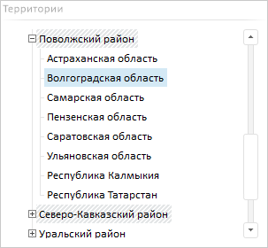
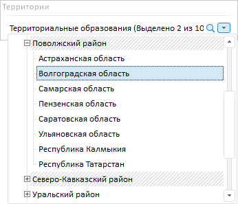
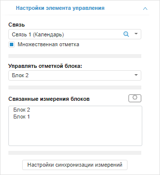

# Настройка списков

Настройка списков
-

# Настройка списков

Элементы управления «Список»
 и «Раскрывающийся список» позволяют
 управлять отметкой элементов измерения блока.

Для вставки списков используйте:

	- команду «Список»/«Раскрывающийся список» в раскрывающемся
	 меню кнопки «Управление» на
	 вкладке «Главная» или «Вставка» ленты инструментов;

	- команду «Список»/«Раскрывающийся список» в раскрывающемся
	 меню пункта «Новый блок > Управление»
	 в контекстном меню аналитической панели.

Элемент управления будет вставлен в рабочую область.

Для вставки элемента управления для конкретного блока:

	- Выделите требуемый блок.

	- Выберите пункт «Список»/«Раскрывающийся список» в раскрывающемся
	 меню кнопки «Управление» на
	 вкладке «Главная» или «Вставка» ленты инструментов. Будет
	 отображено меню со всеми связями блока, для которых возможно создание
	 элемента управления. Наименование связи формируется по схеме: Связь <номер_связи> (<наименование_управляемого_измерения>).

	- Выберите требуемую связь.

Элемент управления будет вставлен в рабочую область и настроен на выбранную
 связь.

Пример элемента управления «Список»:

Пример элемента управления «Раскрывающийся
 список»:

Для изменения отметки, вида или редактирования элементов выбранного
 измерения используйте команды из раскрывающегося меню пункта «Элемент
 управления» контекстного меню элементов управления «Список»
 и «Раскрывающийся Список» или
 отметьте необходимые элементы измерения вручную.

Примечание.
 Список элементов измерения блока соответствует справочнику источника данных
 выбранного блока.

Для настройки параметров элементов управления «Список»
 и «Раскрывающийся Список» используйте
 вкладку «[Настройка
 элемента управления](#options)» на боковой панели.

## Настройка базовых параметров

Для настройки базовых параметров списка используйте вкладку «[Блок](../../Document/Block_BaseProps.htm)» на боковой
 панели.

[Для отображения
 вкладки](javascript:TextPopup(this))

		- Убедитесь, что боковая панель отображается.

		- Выделите блок на рабочей области.

		- Перейдите на вкладку «Блок».

Помимо параметров, доступных для всех объектов в аналитической панели,
 для списка также доступны настройки шрифта:

	- Шрифт.
	 Выберите один из шрифтов, установленных в операционной системе;

	- Размер
	 шрифта. Установите требуемый размер шрифта. Размер задаётся
	 в пунктах, и его можно выбрать из раскрывающегося списка или ввести
	 вручную. Диапазон допустимых значений: [1, 72];

	- Начертание
	 надписи. Нажмите кнопки, задающие начертание шрифта:

		- Ж. Полужирное начертание;

		- К. Курсивное начертание;

		- Ч. Подчеркивание
		 текста.

При нажатой кнопке будет использоваться соответствующий
 стиль начертания. Доступно использование нескольких стилей одновременно,
 например, нажатие кнопок «Ж» и
 «К» даёт полужирное курсивное
 начертание;

	- Цвет шрифта. Выберите
	 цвет шрифта в раскрывающейся палитре цветов. Для установки нового
	 цвета шрифта перейдите на вкладку «Спектр»
	 в палитре цветов и выберите цвет в расширенной палитре.

## Настройка элемента управления

Вкладка «Настройка элемента управления»
 боковой панели предназначена для настройки элементов управления «Список» и «Раскрывающийся
 список».

[Для отображения
 вкладки](javascript:TextPopup(this))

		- Убедитесь, что боковая панель отображается.

		- Выделите «Список»
		 или «Раскрывающийся список»
		 в рабочей области.

		- Перейдите на вкладку «Настройки
		 элемента управления».

На вкладке доступны следующие настройки элемента управления:

[Связь](javascript:TextPopup(this))

	В раскрывающемся списке выберите связь, соответствующую управляемому
	 измерению. Одна связь может управлять измерением, которое используется
	 в нескольких блоках аналитической панели.

	Наименование связи формируется по схеме: Связь
	 <номер_связи> (<наименование_управляемого_измерения>).

	Для создания новой связи в раскрывающемся списке «Связь»
	 предназначен элемент «Новая связь»,
	 содержащий иерархический список блоков и их доступных измерений. Выберите
	 требуемое измерение, содержащееся в списке «Новая
	 связь». Связь будет создана и выбрана для элемента управления.

	Совет. Для просмотра
	 и управления связями используйте вкладки боковой панели: «[Синхронизация измерений документа](../Dimension_links.htm#dashboard)»
	 для работы со связями всех блоков аналитической панели, «[Синхронизация измерений](../Dimension_links.htm#block)»
	 для работы со связями выделенного блока.

[Множественная
 отметка](javascript:TextPopup(this))

	Параметр «Множественная отметка»
	 доступен, если задана связь. По умолчанию флажок установлен и в элементе
	 управления доступна множественная отметка элементов управляемого измерения.

	Совет. Снимите
	 флажок «Множественная отметка»,
	 если элемент управления предназначен для [фиксированного
	 измерения](UiSelection.chm::/Selection/Dimension.htm#variant_of_location).

[Управлять отметкой
 блока](javascript:TextPopup(this))

	Раскрывающийся список «Управлять
	 отметкой блока» содержит список блоков, которые состоят в указанной
	 связи. Выберите блок, измерение которого будет использоваться в элементе
	 управления.

	Элемент управления имеет двустороннюю связь с выбранным измерением
	 блока. Если [отметка
	 измерения](UiSelection.chm::/Selection/Dimension.htm)
	 будет изменена в блоке, то это отразится в списке и наоборот. Если
	 блок содержит визуализатор «[Таблица](../Gadgets/Table.htm)»,
	 то при [детализации](UiAnalyticalArea.chm::/Working_with_table_data/Drill_down.htm)
	 в реляционные данные отметка измерения в списке будет синхронизироваться
	 с отметкой в таблице по заданной связи. При обобщении реляционных
	 данных блок и связанный элемент управления синхронизируется с отметкой
	 и выделенным данным по заданным связям между блоками. Детализация
	 в реляционные данные доступна на основе [SQL-запроса](uinavobj.chm::/Cube/CreateCube/Master_Standart/UiMd_Cube_CreateCube_Master_Standart_2.htm#details_sql_query)
	 или при настроенной [серверной
	 агрегации измерения фактов](uinavobj.chm::/Cube/CreateCube/Master_Standart/UiMd_Cube_CreateCube_Master_Standart_2.htm#agregation).

[Связанные измерения
 блоков](javascript:TextPopup(this))

	Список «Связанные измерения блоков»
	 содержит наименования блоков, измерениями которых управляет связь.

		- Для удаления связи.
		 Нажмите кнопку  «Действия»
		 и в отобразившемся меню выполните команду «Удалить
		 связь». Связь будет удалена. Элемент управления перестанет
		 управлять каким-либо измерением;

		- Для удаления выделенного
		 блока из связи. Нажмите кнопку  «Действия» и в отобразившемся
		 меню выполните команду «Убрать
		 из связи». Блок будет удален из связи. Элемент управления
		 перестанет управлять измерением удаленного блока.

[Настройки синхронизации измерений](javascript:TextPopup(this))

	Для работы со связями всех блоков аналитической панели нажмите кнопку
	 «Настройки синхронизации измерений»/«Показать все связи документа». Отобразится
	 вкладка боковой панели «[Синхронизация
	 измерений документа](../Dimension_links.htm#dashboard)».

См. также:

[Вставка и
 настройка интерактивных элементов управления](Controls.htm)

		Справочная
		 система на версию 10.9
		 от 18/08/2025,
		 © ООО «ФОРСАЙТ»,
