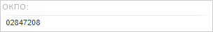
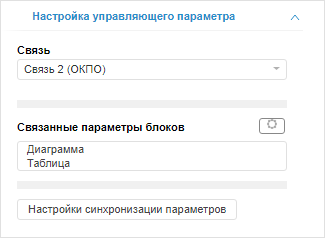

# Настройка управляющего параметра

Настройка управляющего параметра
-

# Настройка управляющего параметра

Элемент управления «Параметр»
 позволяет управлять параметрами [источников
 данных](../Gadgets/Panels/Select_DataSource.htm), используемых блоками аналитической панели.

Для добавления на аналитическую панель параметра выполните:

	- команду «Новый блок > Управление > Параметр»
	 в контекстном меню аналитической панели;

	- команду «Параметр» в
	 раскрывающемся меню кнопки «Управление»,
	 расположенной на вкладке «Главная»
	 или «Вставка» ленты инструментов.

Пример элемента управления «Параметр»:

Для настройки элемента управления «Параметр»
 используйте вкладку «Настройка управляющего
 параметра» на боковой панели:

[Для отображения
 вкладки](javascript:TextPopup(this))

		- Убедитесь, что боковая панель отображается.

		- Выделите «Параметр».

		- Перейдите на вкладку «Настройка
		 управляющего параметра».

В раскрывающемся списке «Связь»
 выберите связь, соответствующую параметру. Одна связь может управлять
 параметром источника данных, используемого в нескольких блоках аналитической
 панели.

После выбора связи будет отображен список «Связанные
 параметры блоков», содержащий перечень блоков, которые управляются
 параметром.

[Для исключения
 блока из связи](javascript:TextPopup(this))

		- Выделите исключаемый блок в списке «Связанные
		 параметры блоков»;

		- Нажмите кнопку . В отобразившемся меню
		 выполните команду «Убрать из
		 связи».

	Блок будет исключен из связи и не будет управляться параметром.

[Для подсветки
 блока, управляемого параметром](javascript:TextPopup(this))

	В списке «Связанные параметры блоков»
	 выделите блок, управляемый параметром. Соответствующий блок будет
	 подсвечен в рабочей области.

[Для настройки
 синхронизации параметров](javascript:TextPopup(this))

	Нажмите кнопку «Настройка синхронизации
	 параметров». Будет открыта вкладка «[Синхронизация параметров документа](../../Document/Params_sync.htm)»,
	 предназначенная для настройки синхронизации всех параметров в аналитической
	 панели.

См. также:

[Вставка и
 настройка интерактивных элементов управления](Controls.htm)

		Справочная
		 система на версию 10.9
		 от 18/08/2025,
		 © ООО «ФОРСАЙТ»,
