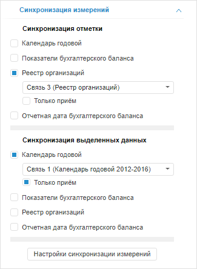
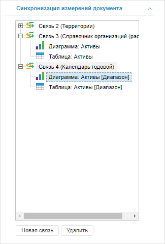
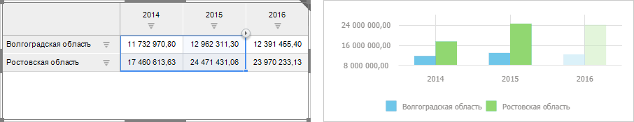
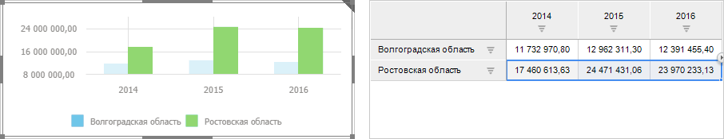
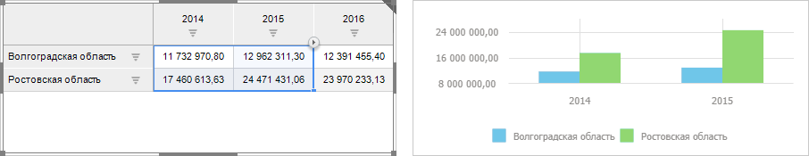

# Настройка синхронизации измерений источников данных

Настройка синхронизации измерений источников данных
-

# Настройка синхронизации измерений источников данных

Синхронизация измерений позволяет управлять отметкой элементов сразу
 в нескольких блоках аналитической панели.

Настройка синхронизации доступна для:

	- всех [визуализаторов](Gadgets/Gadgets.htm);

	- отчёта «[Экспресс-отчёт](Reports/Express_Report.htm)»;

	- отчёта «[Временные
	 ряды](Reports/TimeSeries.htm)» (только для календарного измерения);

	- отчёта «[Регламентный
	 отчёт](Reports/Procedural_report.htm)» (если отчёт содержит элемент управления, настроенный
	 на измерение источника данных).

Синхронизация выполняется с помощью связей между измерениями. Для корректной
 настройки синхронизируемые измерения блоков должны быть построены на одном
 справочнике.

	Связи могут быть двух видов:

		- двусторонние. Связь
		 может как принимать, так и передавать отметку в управляемые блоки;

		- односторонние. Связь
		 может только принимать отметку от других блоков, с которыми настроена
		 синхронизация.

	Примечание.
	 Синхронизация измерений не настраивается автоматически, даже если
	 создаются блоки, настроенные на один источник данных. Все настройки
	 синхронизации определяются пользователем.

	Настройка синхронизации измерений источников данных может быть выполнена
	 как для отдельных [блоков](Dimension_links.htm#block),
	 так и для всей [аналитической
	 панели](Dimension_links.htm#dashboard).

## Синхронизация измерений источника данных блока

	Для настройки синхронизации измерений источника данных блока используйте
	 вкладку «Синхронизация измерений»
	 на боковой панели.

	[Для отображения
	 вкладки](javascript:TextPopup(this))

		Первый способ:

			- выполните команду «Настройки
			 синхронизации» в контекстном меню блока, для которого
			 доступна настройка синхронизации измерений.

		Второй способ:

			- Убедитесь, что боковая панель отображается.

			- В рабочей области выделите блок, для которого доступна
			 настройка синхронизации измерений.

			- Если выделен визуализатор, то установите на боковой
			 панели переключатель «Блок».

			- Перейдите на вкладку «Синхронизация
			 измерений».

	

	На вкладке присутствуют две группы:

		- Синхронизация отметки.
		 Предназначена для настройки синхронизации отметки измерений. Синхронизация
		 отметки позволяет, например, перестраивать диаграмму в соответствии
		 с отметкой в таблице или перестраивать карту в соответствии с
		 отметкой на пузырьковой диаграмме;

	Примечание.
	 Если для отметки элементов измерения используется [схема
	 отметки](UiSelection.chm::/Selection/Selection_of_the_dimension_elements.htm#schemas) или [группа
	 элементов](UiSelection.chm::/Selection/Selection_of_the_dimension_elements.htm#group), то синхронизация с другими блоками осуществляется
	 только по отмеченным элементам, которые передаются в результате использования
	 одного из способов отметки. Настройки схемы отметки или группы элементов
	 не передаются.

		- Синхронизация выделенных
		 данных. Предназначена для настройки синхронизации выделенных
		 данных. Синхронизация выделенных данных позволяет, например, выделять
		 данные на диаграмме в соответствии с выделением в таблице или
		 отмечать регион на карте в соответствии с выделением пузырька
		 на пузырьковой диаграмме. Если в визуализаторе используется прокрутка
		 или масштабирование по оси категорий, то будет выполнено перемещение
		 к элементам, которые должны быть выделены.

		Если блоки синхронизированы по выделению, но не синхронизированы
		 по отметке, то при выделении элементов в исходном блоке в принимающем
		 будет выделяться только та часть элементов, которые есть в его
		 отметке.

	Примечание.
	 Если блок аналитической панели содержит визуализатор «[Таблица](Gadgets/Table.htm)», то при [детализации](UiAnalyticalArea.chm::/Working_with_table_data/Drill_down.htm)
	 в реляционные данные синхронизация с другими блоками не выполняется.
	 При обобщении реляционных данных блок синхронизируется с отметкой
	 и выделенными данными по заданным связям между блоками. Детализация
	 в реляционные данные доступна на основе [SQL-запроса](uinavobj.chm::/Cube/CreateCube/Master_Standart/UiMd_Cube_CreateCube_Master_Standart_2.htm#details_sql_query)
	 или при настроенной [серверной
	 агрегации измерения фактов](uinavobj.chm::/Cube/CreateCube/Master_Standart/UiMd_Cube_CreateCube_Master_Standart_2.htm#agregation).

	Набор измерений в обеих группах одинаковый и совпадает с набором
	 измерений в источнике данных блока. Каждому измерению соответствует
	 флажок:

		- Флажок установлен.
		 Измерению сопоставляется связь. Наименование связи формируется
		 по схеме: Связь <номер_связи>
		 (<наименование_управляемого_измерения>). Если одному
		 и тому же измерению в нескольких блоках сопоставлена одна и та
		 же связь, то измерение синхронизируется и изменение отметки/выделения
		 данных в одном блоке будет влиять на отметку/выделение данных
		 в других блоках.

		Для создания новой связи выберите элемент «<Новая
		 связь>» в раскрывающемся списке требуемого измерения.
		 Элемент доступен, если аналитическая панель содержит блок, в котором
		 присутствует такое же измерение, которому сопоставлена связь.

		Если флажок, соответствующий измерению, установлен, то отображается
		 дополнительный флажок:

			- Только
			 прием. По умолчанию флажок снят. Установка флажка означает,
			 что связь будет односторонней и текущий блок не будет передавать
			 свою отметку/выделение данных в связи, а будет только принимать
			 их из связанных блоков;

Примечание.
 Связь может быть создана, только если синхронизируемое измерение имеет
 атрибут с назначением «[Идентификатор](UiNavObj.chm::/reference_book/Master_Table_reference_book/UiMd_reference_book_Master_Table_page1_AttProps.htm)».

		- Флажок снят. Используется
		 по умолчанию. Измерение независимо. Изменение отметки элементов
		 и изменение выделения данных не влияет на другие блоки. Изменение
		 отметки и выделения по данному измерению в других блоках не влияет
		 на отметку элементов и выделение данных в настраиваемом блоке.

	Совет. Для настройки
	 синхронизации измерений во всех блоках аналитической панели нажмите
	 кнопку «Настройки синхронизации измерений».
	 На боковой панели будет открыта вкладка «Синхронизация
	 измерений документа».

## Синхронизация измерений всех источников
	 данных аналитической панели

	Для настройки синхронизации измерений всех источников данных, используемых
	 в аналитической панели, используйте вкладку боковой панели «Синхронизация измерений документа».

	[Для отображения
	 вкладки](javascript:TextPopup(this))

			- Убедитесь, что боковая панель отображается.

			- Щелкните по пустому пространству в рабочей области.

			- Перейдите на вкладку «Синхронизация
			 измерений документа».

	

	На вкладке содержится список связей измерений для всех блоков аналитической
	 панели. На основании любого измерения блока можно создать только одну
	 связь. На основании одного и того же измерения в составе различных
	 блоков можно создать как одну, так и несколько связей.

	Наименование связи формируется по схеме: Связь
	 <номер_связи> (<наименование_измерения>). Для каждой
	 связи приведен список блоков, использующих данную связь.

	[Создание
	 новой связи](javascript:TextPopup(this))

Примечание.
 Связь может быть создана, только если синхронизируемое измерение имеет
 атрибут с назначением «[Идентификатор](UiNavObj.chm::/reference_book/Master_Table_reference_book/UiMd_reference_book_Master_Table_page1_AttProps.htm)».

		Связь может быть создана:

			- на основе одного или нескольких блоков, уже использующихся
			 в какой-либо связи. Для создания связи:

				- Перейдите на вкладку «Синхронизация
				 измерений документа» на боковой панели.

				- Выделите блоки, использующиеся в одной связи.

				- Нажмите кнопку «Новая
				 связь» или перетащите выбранные связи в конец списка
				 связей.

		Выделенные блоки будут исключены
		 из связи. На их основе будет создана новая связь, которая будет
		 отображена на вкладке «Синхронизация
		 измерений документа».

			- на основе нескольких блоков, имеющих одинаковые измерения.
			 Для создания связи:

				- Выделите несколько
				 блоков в рабочей области.

				- Нажмите кнопку  «Связь»
				 на вкладке «Главная»
				 ленты инструментов.

				- Будет отображен диалог
				 «Новая связь»:

		

		В диалоге отображаются общие несвязанные измерения блоков. Если
		 у блоков нет общих несвязанных измерений, то будет отображено
		 соответствующее сообщение.

				- Установите флажки напротив тех измерений, на основе
				 которых должны быть созданы связи. Для отметки всех измерений
				 установите флажок «Измерение».

		На основе каждого выделенного измерения
		 будет создана новая связь. Все созданные связи будут отображены
		 на вкладке «Синхронизация измерений
		 документа».

	[Удаление
	 связи](javascript:TextPopup(this))

		Для удаления связи:

			- Выберите требуемую связь. В настольном приложении доступно
			 выделение сразу нескольких связей.

			- Нажмите кнопку «Удалить».

		Выбранная связь будет удалена из всех блоков, в которых она
		 используется без запроса подтверждения выполняемого действия.

	[Исключение
	 блока из связи](javascript:TextPopup(this))

		Для исключения блока из связи:

			- Выберите требуемый блок. В настольном приложении доступно
			 выделение сразу нескольких блоков, в том числе и в разных
			 связях.

			- Нажмите кнопку «Удалить».

		Выбранный блок будет исключен из связи без запроса подтверждения
		 выполняемого действия.

	[Перемещение
	 блока из одной связи в другую](javascript:TextPopup(this))

		Переместить блок из одной связи в другую возможно, если данным
		 связям сопоставлено одно и тоже измерение.

		Для перемещения блока из одной связи в другую:

			- Выделите требуемый блок. В настольном приложении доступно
			 выделение нескольких блоков, в том числе и в разных связях.

			- Зажмите кнопку мыши и перетащите выбранный блок в требуемую
			 связь.

		Связь будет перемещена в выбранный блок без запроса подтверждения
		 выполняемого действия.

	[Подсветки
	 блока, использующего связь/измерение](javascript:TextPopup(this))

		Для подсветки блока, использующего связь, выделите на вкладке
		 требуемый блок. Соответствующий блок будет подсвечен в рабочей
		 области.

		Для подсветки всех блоков, использующих связь, выделите на вкладке
		 требуемую связь. Соответствующие блоки будут подсвечены в рабочей
		 области.

## Примеры синхронизации измерений в визуализаторах

	[Пример
	 функционирования синхронизации отметок измерений](javascript:TextPopup(this))

		Допустим, есть визуализаторы «[Таблица](Gadgets/Table.htm)»
		 и «[Диаграмма](Gadgets/Diagram.htm)»,
		 настроенные на один источник данных. В группе «Синхронизация
		 отметки» календарному измерению в каждом визуализаторе
		 сопоставлена «Связь 1 (Календарь)».
		 Есть элемент управления «[Список](Controls/List.htm)», настроенный на данную
		 связь.

		Поведение блоков при изменении отметки
		 в календарном измерении будет следующим:

			- изменение отметки в элементе управления влияет на
			оба визуализатора;

			- изменение отметки в визуализаторе «Таблица»
			влияет на визуализатор «Диаграмма»
			и на элемент управления;

			- изменение отметки в визуализаторе «Диаграмма»
			влияет на визуализатор «Таблица»
			и на элемент управления.

	[Пример
	 функционирования независимых измерений](javascript:TextPopup(this))

		Допустим, есть визуализаторы «[Таблица](Gadgets/Table.htm)»
		 и «[Диаграмма](Gadgets/Diagram.htm)»,
		 настроенные на один источник данных. В группе «Синхронизация
		 отметки» календарному измерению в визуализаторе «Таблица» сопоставлена «Связь 1 (Календарь)». Есть
		 элемент управления «[Список](Controls/List.htm)»,
		 настроенный на данную связь. Календарное измерение в визуализаторе
		 «Диаграмма» независимо.

		Поведение блоков при изменении отметки
		 в календарном измерении будет следующим:

			- изменение отметки в элементе управления влияет только
			на визуализатор «Таблица»;

			- изменение отметки в визуализаторе «Таблица»
			влияет только на элемент управления;

			- изменение отметки в визуализаторе «Диаграмма»
			не влияет ни на один блок.

	[Пример
	 передачи выделения данных между визуализаторами](javascript:TextPopup(this))

		Допустим, есть визуализаторы «[Таблица](Gadgets/Table.htm)» и «[Диаграмма](Gadgets/Diagram.htm)», настроенные
		 на один источник данных.

		В группе «Синхронизация выделенных
		 данных» календарному измерению визуализаторов «Диаграмма»
		 и «Таблица» сопоставлена
		 «Связь 1 (Календарь)».
		 В результате, изменение выделения в визуализаторе «Таблица»
		 влияет на визуализатор «Диаграмма»
		 и наоборот. Например, если в визуализаторе «Таблица»
		 выделить столбец данных, то ряды, ему соответствующие, будут автоматически
		 выделены в визуализаторе «Диаграмма»:

		

		В группе «Синхронизация выделенных
		 данных» календарному измерению в визуализаторах «Диаграмма» и «Таблица»
		 сопоставлена «Связь 1 (Календарь)».
		 В визуализаторе «Таблица»
		 установлен только прием выделения данных. В результате изменение
		 выделения в визуализаторе «Диаграмма»
		 влияет на визуализатор «Таблица»,
		 а выделение в визуализаторе «Таблица»
		 не влияет на визуализатор «Диаграмма».
		 Например, если в визуализаторе «Диаграмма»
		 выделить один ряд, то данные, ему соответствующие, будут автоматически
		 выделены в визуализаторе «Таблица»:

		

	[Пример
	 передачи отметки по выделенным данным между визуализаторами](javascript:TextPopup(this))

		Допустим, есть визуализаторы «[Таблица](Gadgets/Table.htm)» и «[Диаграмма](Gadgets/Diagram.htm)», настроенные
		 на один источник данных.

		В группе «Синхронизация выделенных
		 данных» календарному измерению визуализатора «Таблица»
		 сопоставлена «Связь 1 (Календарь)»,
		 а для визуализатора «Диаграмма»
		 данная связь сопоставлена календарному измерению в группе «Синхронизация отметки».

		В результате, изменение выделения в визуализаторе «Таблица»
		 влияет на отметку в визуализаторе «Диаграмма».
		 Например, если в визуализаторе «Таблица»
		 выделить столбец данных, то отметка в визуализаторе «Диаграмма» будет автоматически
		 изменена таким образом, чтобы в неё входили только данные, выделенные
		 в визуализаторе «Таблица».
		 Визуализатор «Диаграмма»
		 будет перестроен в соответствии с выделением:

		

См. также:

[Вставка
 и настройка визуализаторов](Gadgets/Gadgets.htm) | [Вставка
 и настройка отчётов](Reports/Reports.htm)

		Справочная
		 система на версию 10.9
		 от 18/08/2025,
		 © ООО «ФОРСАЙТ»,
