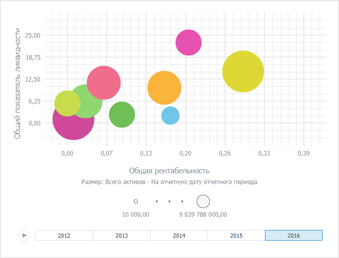

# Настройка визуализатора «Пузырьковая диаграмма»

Настройка визуализатора «Пузырьковая диаграмма»
-

# Настройка визуализатора «Пузырьковая диаграмма»

Визуализатор предназначен для отображения данных в виде пузырьковой
 диаграммы.

Пузырьковая диаграмма - это
 точечная диаграмма, в которой точки данных заменены пузырьками. Размер
 пузырьков является дополнительным измерением данных.

Важно. Перед
 работой с визуализатором убедитесь в соблюдении системных требований к
 [клиентскому
 компьютеру](Setup.chm::/03_DB_Server_Config/Setup_DB_ServerSysReq.htm#client) для настольного приложения и к [BI-серверу](Setup.chm::/03_DB_Server_Config/Setup_DB_ServerSysReq.htm#bi)
 для веб-приложения. В веб-приложении поддержка визуализаторов осуществляется,
 если BI-сервер установлен на ОС Windows 7 и выше. Внешний вид визуализатора
 может отличаться в зависимости от используемых графических библиотек DirectX
 11 или OpenGL 3.1.

На пузырьковой диаграмме оси категорий и значений совпадают. Горизонтальная
 и вертикальная оси являются осями значений.

Дополнительно в продукте «Форсайт. Аналитическая платформа»
 пузырьковая диаграмма содержит анимированную временную шкалу, отображающую
 динамику значений.

Пузырьковая диаграмма позволяет отобразить наборы из четырех значений:

	- 1-е значение: по оси X;

	- 2-е значение: по оси Y;

	- 3-е значение: размер пузырьков;

	- 4-е значение: цвет пузырьков.

Для вставки визуализатора используйте:

	- команду «Пузырьковая диаграмма»
	 в раскрывающемся меню кнопки «Визуализаторы»
	 на вкладке «Главная» ленты
	 инструментов;

	- кнопку «Пузырьковая диаграмма»
	 в группе «Визуализаторы» на
	 вкладке ленты «Вставка»;

	- команду «Пузырьковая диаграмма»
	 в раскрывающемся меню пункта «Новый
	 блок» в контекстном меню аналитической панели.

Затем задайте [источник данных](Panels/Select_DataSource.htm)
 для пузырьковой диаграммы и [настройте измерения](UiSelection.chm::/Selection/Dimension_type.htm).

Пример визуализатора «Пузырьковая
 диаграмма»:

## Операции с пузырьковой диаграммой

Для визуализатора «Пузырьковая диаграмма»
 доступны все операции с объектами, приведенные в разделах «[Построение
 аналитической панели](../../Document/Work.htm)» и «[Вставка и настройка
 визуализаторов](Gadgets.htm)».

### Основные операции, доступные для пузырьковой диаграммы

[Настройка
 измерения метрик](javascript:TextPopup(this))

	[Сопоставьте
	 элементы](UiSelection.chm::/Selection/Dimension_type.htm#metric) измерения метрик и следующие характеристики
	 пузырьковой диаграммы:

		- Ось X. Установите
		 переключатель «X» на вкладке
		 измерения и отметьте элемент, значения которого будут отображаться
		 по оси X.

		- Ось Y. Установите
		 переключатель «Y» на вкладке
		 измерения и отметьте элемент, значения которого будут отображаться
		 по оси Y.

		- Диаметр пузырьков.
		 Установите переключатель «Размер»
		 на вкладке измерения и отметьте элемент, по значениям которого
		 будет определяться диаметр пузырьков.

		- Цвет заливки пузырьков.
		 Установите переключатель «Цвет»
		 на вкладке измерения и отметьте элемент, по значениям которого
		 будут закрашиваться пузырьки.

	Пузырьковая диаграмма будет перестроена по заданным характеристикам.

[Настройка
 области построения](javascript:TextPopup(this))

	Для настройки заливки и границ области построения используйте вкладку
	 боковой панели «[Область построения](UiVisualizators.chm::/BubbleChart/BubbleChart_area_settings.htm)».

[Настройка
 заливки пузырьков](javascript:TextPopup(this))

	Примечание.
	 Возможность доступна, если в [измерении метрик](UiSelection.chm::/Selection/Dimension_type.htm) задан элемент, определяющий цвет заливки
	 пузырьков.

Используйте вкладку «[Цвет](UiMaps.chm::/Configure/Color.htm)»
 на боковой панели.

Настройка выполняется аналогично настройке заливки для визуализатора
 «[Карта](Map.htm)».

[Настройка
 размера пузырьков](javascript:TextPopup(this))

	Примечание.
	 Возможность доступна, если в [измерении метрик](UiSelection.chm::/Selection/Dimension_type.htm) задан элемент, определяющий диаметр пузырьков.

	Для настройки размера пузырьков используйте вкладку «Размер»
	 на боковой панели.

	Работа с параметрами на вкладке аналогична работе с параметрами
	 на вкладке «[Объем](UiMaps.chm::/Configure/Panel_Height.htm)»
	 для карты. Отличие в том, что настраивается не высота территорий карты,
	 а диаметр пузырьков.

[Настройка
 осей пузырьковой диаграммы](javascript:TextPopup(this))

	Для настройки параметров осей пузырьковой диаграммы используйте
	 вкладки «[Ось X](UiVisualizators.chm::/BubbleChart/Axis.htm)» и «[Ось Y](UiVisualizators.chm::/BubbleChart/Axis.htm)»
	 на боковой панели.

	Примечание.
	 Для визуализатора «Пузырьковая диаграмма»
	 вкладка «Ось Y» на боковой
	 панели аналогична вкладке «Ось X».

[Настройка
 линии тренда](javascript:TextPopup(this))

	Для настройки линии тренда используйте вкладку «[Линия тренда](UiVisualizators.chm::/BubbleChart/TrendLine.htm)»
	 на боковой панели.

[Настройка
 всплывающих подсказок](javascript:TextPopup(this))

	Для настройки всплывающих подсказок используйте вкладку «[Подсказки](UiVisualizators.chm::/BubbleChart/Tooltip.htm)»
	 на боковой панели.

[Настройка
 легенды цвета и размера](javascript:TextPopup(this))

Для настройки оформления легенды используйте вкладки боковой панели
 [«Легенда цвета»/«Легенда
 размера»](UiMaps.chm::/Legend/SetupLegend.htm).

Настройка выполняется аналогично настройке легенды визуализатора «[Карта](Map.htm)».

[Детализация/обобщение
 данных](javascript:TextPopup(this))

	Детализация данных - операция, позволяющая переходить по уровням
	 данных: от итоговых до детализированных. Доступная глубина детализации
	 определяется иерархией измерений источника данных.

	Если для пузырька доступна детализация, то в его контекстном меню
	 присутствует команда «Пузырьковая
	 диаграмма > Детализировать».

	Для детализации данных:

		- выполните команду «Пузырьковая
		 диаграмма > Детализировать» в контекстном меню пузырька;

		- дважды щёлкните по пузырьку.

	Обобщение - операция обратная детализации, позволяющая переходить
	 от детализированных данных к общим.

	Для обобщения данных:

		- выполните команду «Диаграмма
		 > Обобщить» в контекстном меню пузырька;

		- зажмите клавишу SHIFT и дважды щёлкните по обобщаемому пузырьку.

[Отображение/скрытие
 временной шкалы](javascript:TextPopup(this))

	Примечание.
	 Возможность доступна, если для календарного измерения используется
	 [роль](UiSelection.chm::/Selection/Dimension_type.htm)
	 «Шкала времени».

	Для управления отображением шкалы используйте флажок в заголовке
	 вкладки «[Временная шкала](UiVisualizators.chm::/BubbleChart/Bubbles_time_scale_panel.htm)»
	 на боковой панели:

		- для отображения шкалы установите флажок;

		- для скрытия шкалы снимите флажок.

	По умолчанию временная шкала отображается на пузырьковой диаграмме.

[Отображение/скрытие
 следов пузырьков](javascript:TextPopup(this))

	Для отображения следа пузырька используйте вкладку «[Временная шкала](UiVisualizators.chm::/BubbleChart/Bubbles_time_scale_panel.htm)»
	 на боковой панели.

[Отображение
 вкладок боковой панели для настройки пузырьковой диаграммы](javascript:TextPopup(this))

	Примечание.
	 Возможность доступна только в веб-приложении.

	Для отображения вкладок боковой панели, предназначенных для настройки
	 пузырьковой диаграммы, выполните команду контекстного меню «Пузырьковая диаграмма > Настройки».

[Настройка
 стиля пузырьковой диаграммы](javascript:TextPopup(this))

	Для настройки стиля пузырьковой диаграммы используйте вкладку «[Пузырьковая диаграмма](UiVisualizators.chm::/BubbleChart/BubbleChart_Style.htm)»
	 ленты инструментов.

См. также:

[Вставка и
 настройка визуализаторов](Gadgets.htm)

		Справочная
		 система на версию 10.9
		 от 18/08/2025,
		 © ООО «ФОРСАЙТ»,
