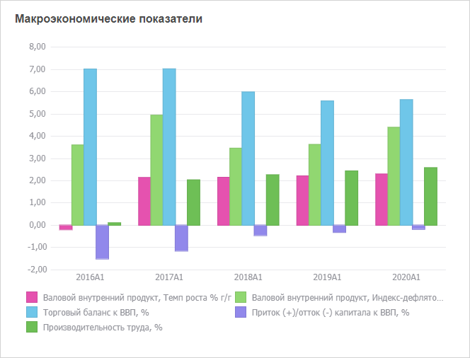
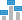

# Настройка визуализатора «Диаграмма»

Настройка визуализатора «Диаграмма»
-

# Настройка визуализатора «Диаграмма»

Визуализатор «Диаграмма» предназначен
 для отображения данных в графическом виде.

Для вставки визуализатора используйте:

	- команду «Диаграмма»
	 в раскрывающемся меню кнопки «Визуализаторы»
	 на вкладке ленты «Главная»;

	- раскрывающееся меню кнопки «Диаграмма»
	 в группе «Визуализаторы» на
	 вкладке ленты «Вставка»;

	- команды, соответствующие типам диаграмм, в раскрывающемся меню
	 пункта «Новый блок» в контекстном
	 меню аналитической панели.

Затем задайте [источник данных](Panels/Select_DataSource.htm)
 для диаграммы.

Доступные типы диаграмм: линейная, гистограмма, линейчатая, с областями,
 круговая, точечная и прочие.

Пример визуализатора «Диаграмма»:

## Операции с диаграммой

Для визуализатора «Диаграмма»
 доступны все операции с объектами, приведенные в разделах «[Построение
 аналитической панели](../../Document/Work.htm)» и «[Вставка и настройка
 визуализаторов](Gadgets.htm)».

Для настройки формата диаграммы вызовите контекстное меню визуализатора
 и выберите пункт «Диаграмма».

Ниже приведено краткое описание основных операций с диаграммой. Для
 получения полного описания обратитесь к разделам «[Настройка компонентов
 диаграммы](UiDiagrams.chm::/UiDiagrams_basic_concept.htm)»
 и «[Работа
 с данными диаграммы](uidiagrams.chm::/Working_with_data/Working_with_data.htm)».

### Основные операции, доступные для диаграммы

[Изменение
 типа диаграммы](javascript:TextPopup(this))

	Выделите визуализатор и укажите тип диаграммы:

		- в раскрывающемся меню кнопки  «Тип» на вкладке ленты инструментов
		 «Диаграмма». Меню содержит
		 пиктограммы, соответствующие различным [типам
		 диаграмм](UiDiagrams.chm::/Type_diagrams/UiDiagrams_Type_diagrams.htm). При наведении указателя мыши на пиктограмму
		 будет отображена всплывающая подсказка с названием типа диаграммы;

		- в контекстном меню диаграммы. Используйте раскрывающееся
		 меню пункта «Тип визуализатора».
		 Меню содержит пункты, соответствующие различным типам диаграмм
		 и визуализаторов;

		- в раскрывающемся списке «Тип
		 диаграммы», расположенном на вкладке боковой панели «[Диаграмма](UiDiagrams.chm::/Params_diagram/UiDiagrams_params_diagram.htm)».

	Диаграмма будет перестроена в соответствии с выбранным типом.

[Настройка
 общих параметров диаграммы](javascript:TextPopup(this))

	Для настройки общих параметров диаграммы используйте вкладку боковой
	 панели «[Диаграмма](UiDiagrams.chm::/Params_diagram/UiDiagrams_params_diagram.htm)».

[Отображение
 вкладок для настройки диаграммы](javascript:TextPopup(this))

	Примечание.
	 Возможность доступна только в веб-приложении.

	Для отображения вкладок боковой панели, предназначенных:

		- для настройки диаграммы.
		 Выполните команду контекстного меню «Диаграмма
		 > Настройки»;

		- для настройки ряда диаграммы.
		 Выполните команду контекстного меню ряда «Диаграмма
		 > Настройки ряда».

[Работа
 с данными диаграммы](javascript:TextPopup(this))

	Доступны следующие операции с данными диаграммы:

		- [детализация
		 и обобщение данных рядов](UiDiagrams.chm::/Working_with_data/Series_drill_down.htm);

		- [нормализация
		 отображаемых данных](UiDiagrams.chm::/Working_with_data/Normalization.htm);

		- [отображение
		 вычисляемых значений](UiDiagrams.chm::/Working_with_data/Showing_Calculated_Values.htm);

		- [исключение
		 рядов из диаграммы](UiDiagrams.chm::/Working_with_data/Excluding_Series_from_Chart.htm);

		- [поворот
		 источника данных](UiDiagrams.chm::/Working_with_data/Rotate_data_source.htm).

### Работа с элементами диаграммы

[Настройка
 легенды](javascript:TextPopup(this))

	Для настройки расположения и оформления легенды используйте вкладку
	 боковой панели «[Легенда](UiDiagrams.chm::/Property_diagramm/UiDiagrams_PropertyDiagramm_legend.htm)».

	Совет. Для быстрой
	 настройки расположения легенды используйте раскрывающееся меню кнопки
	  «Легенда» на вкладке ленты инструментов
	 «Диаграмма».

[Настройка
 области построения](javascript:TextPopup(this))

	Для настройки области построения диаграммы используйте вкладку боковой
	 панели «[Область построения](UiDiagrams.chm::/Tuning_format/uidiagrams_tuning_construction_area_digramm.htm)».

[Настройка
 оси значений](javascript:TextPopup(this))

	Для настройки оси значений диаграммы используйте вкладку боковой
	 панели «[Ось значений (Y)](UiDiagrams.chm::/Params_diagram/UiDiagrams_Axis.htm)».

[Настройка
 оси категорий](javascript:TextPopup(this))

	Для настройки оси категорий диаграммы используйте вкладку боковой
	 панели «[Ось категорий (X)](UiDiagrams.chm::/Params_diagram/UiDiagrams_Axis.htm)».

[Настройка
 дополнительной оси значений](javascript:TextPopup(this))

	Для настройки дополнительной оси значений диаграммы используйте
	 вкладку боковой панели «[Ось
	 значений (дополнительная)](UiDiagrams.chm::/Params_diagram/UiDiagrams_Axis.htm)».

	Совет. Для отображения
	 дополнительной оси перейдите на вкладку боковой панели «[Ряды
	 данных](UiDiagrams.chm::/Series.htm)» и установите флажок «По
	 дополнительной оси» для одного или нескольких рядов.

[Скрытие/отображение
 ряда](javascript:TextPopup(this))

	Для скрытия/отображения ряда щелкните по его наименованию в легенде.

[Настройка
 рядов данных](javascript:TextPopup(this))

	Для настройки рядов данных используйте вкладку боковой панели «[Ряды
	 данных](UiDiagrams.chm::/Series.htm)».

[Настройка
 линий уровня](javascript:TextPopup(this))

	Для добавления и настройки линий уровня используйте вкладку боковой
	 панели «[Линии уровня](UiDiagrams.chm::/Tuning_format/Format_Axis/UiDiagrams_FormatAxis_Levels.htm)».

[Настройка
 всплывающих подсказок](javascript:TextPopup(this))

	Для настройки всплывающих подсказок используйте вкладку «[Подсказки](UiDiagrams.chm::/Params_diagram/Tooltips.htm)»
	 на боковой панели.

[Настройка
 подписей данных](javascript:TextPopup(this))

	Для отображения/скрытия подписей данных используйте:

		- кнопку  «Подписи данных» на вкладке ленты
		 инструментов «Диаграмма».
		 Если кнопка нажата - подписи отображаются;

		- флажок «Подписи данных»
		 на вкладке боковой панели «[Ряды
		 данных](UiDiagrams.chm::/Series.htm)». Если флажок установлен - подписи
		 отображаются.

	Для настройки положения подписи относительно ряда используйте команды
	 в раскрывающемся меню кнопки  «Подписи данных» на вкладке ленты
	 инструментов «Диаграмма»:
	 в центре, справа, слева.

	Для настройки формата текста подписей используйте группу «Подписи данных» на вкладке боковой
	 панели.

[Просмотр
 значения точки](javascript:TextPopup(this))

	Для настройки отображения значений точек используйте вкладку «[Подсказки](uidiagrams.chm::/Params_diagram/Tooltips.htm)»
	 на боковой панели.

	Если для точек настроены подсказки, то для просмотра значения какой-либо
	 точки наведите на неё указатель мыши. Значение будет отображено в
	 виде всплывающей подсказки.

См. также:

[Вставка и
 настройка визуализаторов](Gadgets.htm)

		Справочная
		 система на версию 10.9
		 от 18/08/2025,
		 © ООО «ФОРСАЙТ»,
