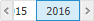
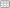

# Вставка и настройка визуализаторов

Вставка и настройка визуализаторов
-

# Вставка и настройка визуализаторов

В аналитической панели визуализаторы используются для отображения информации
 из источников с возможностью анализа и настройки отображаемых данных.
 Доступные визуализаторы:

	- [Таблица](Table.htm).
	 Отображает табличные данные;

	- [Диаграмма](Diagram.htm).
	 Отображает данные в виде графиков;

	- [Карта](Map.htm). Отображает
	 картографические данные;

	- [Пузырьковая
	 диаграмма](Bubbles.htm). Отображает данные в виде пузырьковой диаграммы;

	- [Пузырьковое
	 дерево](Bubble_Tree.htm). Отображает иерархические данные в виде пузырькового дерева;

	- [Плоское дерево](Map_Tree.htm).
	 Отображает иерархические данные в виде плоского дерева;

	- [Индикатор](Indicator.htm).
	 Отображает данные с помощью маркированной шкалы. Доступен только в
	 веб-приложении.

## Операции с визуализаторами

Для всех визуализаторов доступны операции с объектами, приведенные в
 разделах «[Основные
 операции с объектами аналитической панели](../../Document/Layout_mode.htm#objects_setup)» и «[Настройка
 внешнего вида элемента эскиза](../../Document/AdjustingAppearance.htm)».

### Специфические операции, доступные для визуализаторов

[Создание
 визуализатора](javascript:TextPopup(this))

	Для создания визуализатора используйте:

		- команды из раскрывающегося меню кнопки «Визуализаторы»
		 на вкладке ленты «Главная»;

		- кнопки из группы «Визуализаторы»
		 на вкладке ленты «Вставка»;

		- команды пункта «Новый блок»
		 в контекстном меню аналитической панели или элемента-контейнера.

	После создания визуализатора задайте его [источник
	 данных](Panels/Select_DataSource.htm).

[Выбор
 источника данных](javascript:TextPopup(this))

	Для выбора источника данных визуализатора используйте вкладку «[Источники
	 данных](Panels/Select_DataSource.htm)» на боковой панели.

[Управление
 параметрами источника данных](javascript:TextPopup(this))

	Для управления параметрами источника данных используйте вкладку
	 «[Параметры
	 источников данных](Panels/DataSource_param.htm)» на боковой панели.

[Настройка
 структуры источника данных визуализатора](javascript:TextPopup(this))

	Для управления структурой источника данных визуализатора используйте
	 вкладку «[Структура
	 источника данных](DS_structure.htm)» в диалоге «Структура
	 и параметры».

[Управление
 параметрами визуализатора](javascript:TextPopup(this))

	Для управления параметрами визуализатора используйте вкладку «[Управление
	 параметрами](Panels/DataSource_param.htm#params)» в диалоге «Структура
	 и параметры».

[Управление
 отображаемыми данными](javascript:TextPopup(this))

	Для управления данными, отображаемыми в визуализаторе, используйте
	 группу вкладок «[Отметка](UiSelection.chm::/Selection/Dimension.htm)»
	 на боковой панели.

[Агрегация
 фиксированных измерений](javascript:TextPopup(this))

	Агрегация позволяет производить множественную отметку элементов
	 фиксированных измерений с применением выбранного метода агрегации.

	Примечание.
	 Агрегация фиксированных измерений недоступна при работе с [глобальным кешем](UiNav.chm::/02_Navigator/Cache_In_Blob.htm).

	Для [агрегации
	 фиксированных измерений](UiNavObj.chm::/Cube/Agregation.htm):

		- Выберите визуализатор, щёлкнув по нему левой кнопкой мыши.

	Примечание.
	 Агрегация применяется только для выбранного визуализатора.

		- Перейдите на вкладку «Данные»
		 из группы «Данные» боковой
		 панели.

		- Выберите необходимый вариант агрегации из раскрывающегося
		 списка «Агрегировать фиксированные
		 измерения»:

			- Нет. Агрегация
			 данных не производится;

			- Сумма. По выбранным
			 элементам в фиксированных измерениях будет произведено суммирование;

			- Максимум. Из
			 выбранных элементов в фиксированных измерениях будет отображено
			 максимальное значение;

			- Минимум. Из
			 выбранных элементов в фиксированных измерениях будет отображено
			 минимальное значение;

			- Из измерений источника.
			 К данным фиксированного измерения применяется метод агрегации,
			 заданный в [настройках](UiNavObj.chm::/Cube/CreateCube/Master_Standart/UiMd_Cube_CreateCube_Master_Standart_7.htm)
			 источника данных.

	При работе с кубами ADOMD используется
	 агрегация, настроенная в соответствующих источниках ADOMD;

			- Из фактов источника.
			 В фиксированных измерениях с полной отметкой используется
			 [агрегация
			 на сервере](UiNavObj.chm::/Cube/Agregation.htm#fact) в соответствии с методами, заданными
			 для [фактов
			 источника](UiNavObj.chm::/Cube/CreateCube/Master_Standart/UiMd_Cube_CreateCube_Master_Standart_2.htm#agregation). Агрегацию из фактов источника
			 необходимо настраивать в том случае, когда в источнике для
			 одного набора измерений есть несколько записей, требующих
			 агрегации.

	Если в настройках агрегации измерения
	 куба установлен флажок «[Агрегировать
	 отмеченные элементы в измерении](uinavobj.chm::/cube/work_cube/tuning_agr/uimd_cube_work_cube_tuning_agr_basic.htm)»,
	 и для фактов на странице «[Привязка фактов](UiNavobj.chm::/Cube/CreateCube/Master_Standart/UiMd_Cube_CreateCube_Master_Standart_2.htm)»
	 выбран метод агрегации, то агрегация рассчитывается на сервере по
	 отмеченным элементам в соответствии с методами, заданными для фактов
	 куба. При единичной отметке родительского элемента агрегация выполняется
	 только для его дочерних элементов. Если в отметке только родительский
	 элемент без дочерних, то данные в него не будут агрегированы. Если
	 флажок снят, то при множественной отметке агрегация выполняется по
	 всему измерению, независимо от отметки. При единичной отметке родительского
	 элемента агрегация выполняется по дочерним элементам.

	Если в качестве таблицы фактов выбран
	 «[Источник
	 данных ODBC](UiNavObj.chm::/ODBC/UiDb_relational_ODBC.htm)», то в мастере стандартного куба для данного
	 источника доступна настройка расчёта [агрегации
	 на клиенте](uinavobj.chm::/Cube/CreateCube/Master_Standart/UiMd_Cube_CreateCube_Master_Standart_2.htm);

			- Среднее. По
			 выбранным элементам в фиксированных измерениях будет отображено
			 среднее значение.

	Примечание.
	 При выборе любого пункта списка, кроме «Нет»,
	 становится активной кнопка «Отметить
	 все фиксированные», при нажатии на которую будут отмечены все
	 элементы в фиксированных измерениях.

[Выбор
 данных для построения визуализатора](javascript:TextPopup(this))

	Примечание.
	 Возможность доступна для всех визуализаторов, кроме визуализатора
	 типа «Таблица».

	Для просмотра исходных данных, по которым построен визуализатор
	 [смените тип визуализатора](Gadgets.htm#chggadgettype)
	 на «Таблица». Будет отображена
	 таблица с исходными данными.

	Для визуализаторов доступен выбор области из таблицы исходных данных,
	 по которой он будет построен. Для выбора области данных, по которой
	 будет строиться визуализатор, нажмите кнопку  «Данные визуализаторов» на вкладке
	 ленты инструментов «Данные».
	 Будет отображено меню:

		- Вся таблица. Визуализатор
		 строится по всей таблице исходных данных;

		- Выделенная область.
		 Визуализатор строится по области, выделенной в таблице исходных
		 данных.

		Особенности построения визуализаторов по выделенной области:

			- если в таблице исходных данных выделена одна ячейка
			 или уголок, то визуализатор будет построен по всей таблице;

			- если в таблице исходных данных с помощью клавиши CTRL
			 выделено несколько диапазонов ячеек, то в визуализатор будет
			 передаваться объединенная по строкам и столбцам отметка по
			 всем выделенным диапазонам.

[Фильтрация
 и преобразование данных](javascript:TextPopup(this))

	Для [фильтрации и преобразования](Panels/Data.htm) данных,
	 отображаемых в визуализаторе, используйте:

		- вкладку «Данные»
		 на боковой панели;

		- вкладку «Данные»
		 на ленте инструментов.

[Настройка
 синхронизации измерений блока](javascript:TextPopup(this))

	Синхронизация измерений позволяет управлять отметкой элементов сразу
	 в нескольких блоках аналитической панели.

	Для настройки синхронизации измерений блока используйте вкладку
	 «[Синхронизация
	 измерений](../Dimension_links.htm)» на боковой панели.

[Настройка
 заголовка визуализатора](javascript:TextPopup(this))

	Примечание.
	 Отображение и настройка заголовка доступны, если для визуализатора
	 задан источник данных.

	Для отображения заголовка установите флажок «Заголовок»,
	 расположенный в контекстном меню визуализатора. По умолчанию флажок
	 «Заголовок» снят и заголовок
	 не отображается.

	Для [настройки структуры](Panels/Caption.htm#caption_struct)
	 заголовка используйте вкладку «Заголовок»
	 на боковой панели.

	Для [настройки оформления](Panels/Caption.htm#caption_format)
	 заголовка используйте вкладку «Заголовок»
	 на ленте инструментов.

[Изменение
 типа визуализатора](javascript:TextPopup(this))

	Для изменения типа визуализатора используйте команду «Тип
	 визуализатора» в контекстном меню визуализатора. В отобразившемся
	 меню укажите требуемый тип визуализатора.

	Визуализатор будет перестроен в соответствии с выбранным типом,
	 сохранив настройки отметки измерения, фильтрации, сортировки и другие
	 настройки пользователя.

[Работа
 с анимацией](javascript:TextPopup(this))

	Примечание.
	 Возможность доступна для визуализаторов «[Карта](Map.htm)»,
	 «[Пузырьковая диаграмма](Bubbles.htm)»,
	 «[Пузырьковое
	 дерево](Bubble_Tree.htm)», «[Плоское
	 дерево](Map_Tree.htm)», «[Индикатор](Indicator.htm)»
	 если в [календарном
	 измерении](UiSelection.chm::/Selection/Dimension_type.htm) отмечено несколько элементов.

	Анимация отражает динамику объектов наблюдения по заданным метрикам
	 в определенный промежуток времени. Для работы с анимацией предназначена
	 временная шкала, расположенная в нижней части визуализатора.

	Для запуска анимации нажмите кнопку . Во время
	 анимации изменяется заливка и прочие элементы, зависящие от типа визуализатора.

	Для приостановки анимации нажмите кнопку .

	Для перемещения по временной шкале используйте кнопки влево и вправо
	 .

[Отображение
 данных, на основании которых строится визуализатор](javascript:TextPopup(this))

	Примечание.
	 Возможность доступна только для визуализаторов, кроме визуализатора
	 типа «[Таблица](Table.htm)».

	Для отображения данных, на основании которых строится визуализатор:

		- Отобразите кнопки управления объектом:

Наведите указатель мыши на уголок в правом верхнем углу блока:

Будут отображены [кнопки управления](../../Document/Block_BaseProps.htm)
 объектом, например:

		- Нажмите кнопку .

	Будут отображены исходные данные визуализатора.

См. также:

[Построение
 аналитической панели](../../Document/Work.htm)

		Справочная
		 система на версию 10.9
		 от 18/08/2025,
		 © ООО «ФОРСАЙТ»,
